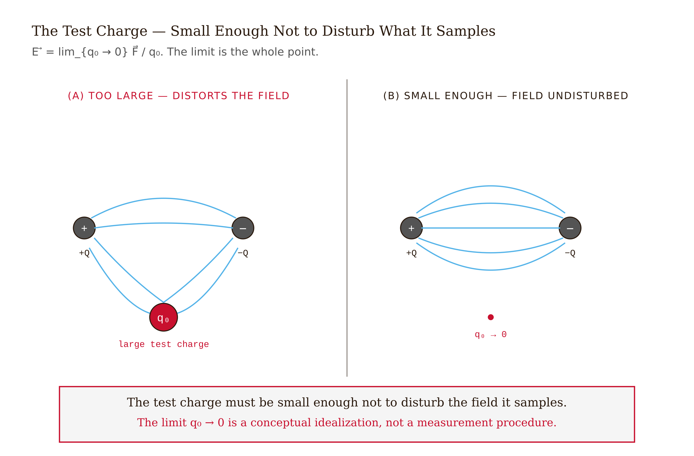
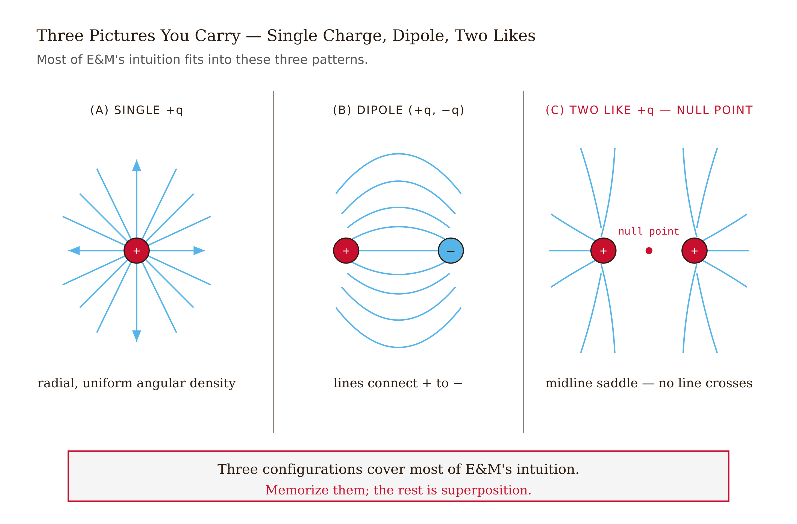
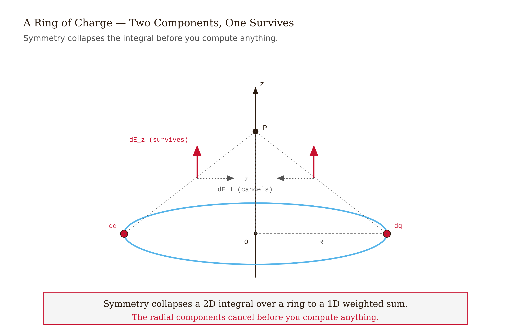
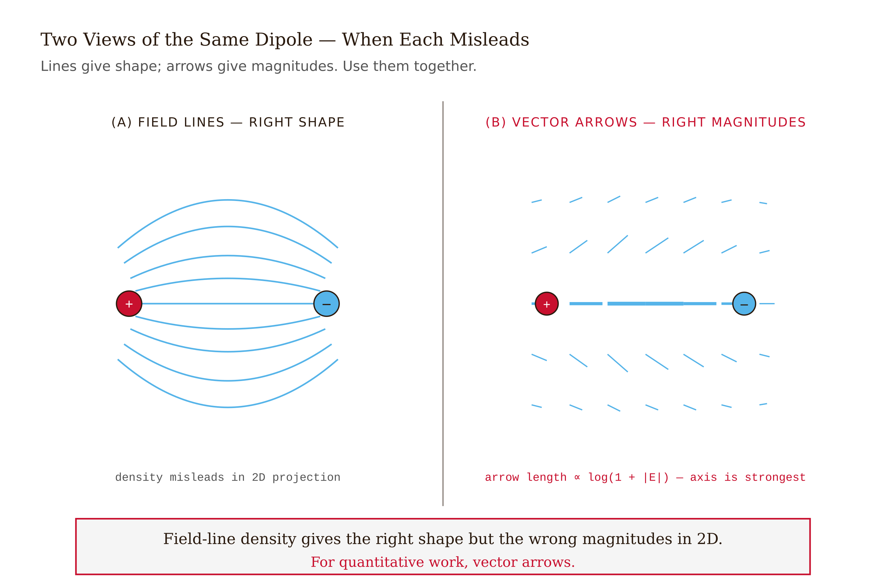
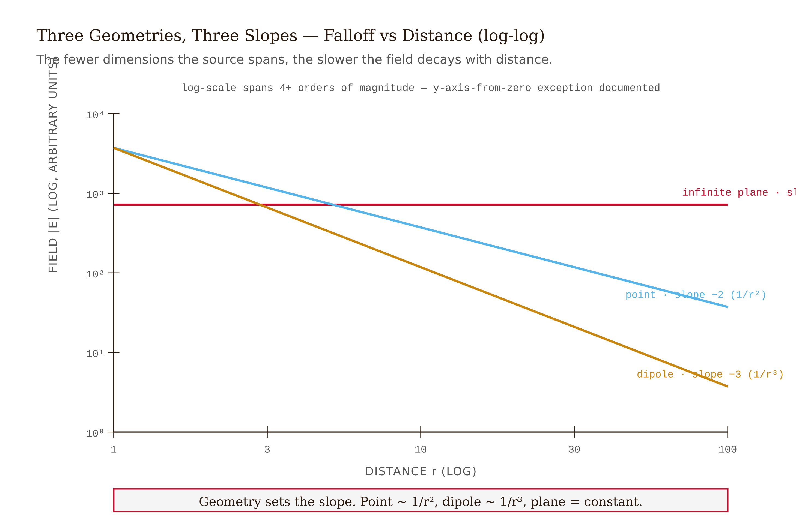

# Chapter 2 — The Electric Field

*From force between charges to field filling space, and the simulation that makes the field visible.*

---

There is a peculiar problem hiding inside Coulomb's law that took physicists about two hundred years to fully appreciate.

You have two charges. They exert forces on each other. The force obeys an inverse-square law — I can tell you the formula, and you can compute the force exactly. So what's the problem?

The problem is: *how does charge A know where charge B is?*

In Newton's gravity, the same question arises. The Earth and the Moon attract each other across three hundred and eighty thousand kilometers of vacuum. Nothing visible connects them. Newton himself found this deeply unsatisfying — he called action at a distance "so great an Absurdity that I believe no Man who has in philosophical Matters a competent Faculty of thinking can ever fall into it." He gave us the formula anyway because it worked. He just couldn't tell you *why* it worked.

*Figure 2.1 — Operational Definition*

<!-- → [IMAGE: portrait or sketch of Faraday in his lab at the Royal Institution, contrasted with a diagram of action-at-a-distance lines between two point masses — to set up the conceptual problem the field solves] -->

For gravity, the problem stayed unsolved until Einstein. For electrostatics, it was solved — or at least transformed into something we can work with — by a self-educated bookbinder's apprentice named Michael Faraday, who never went to university and couldn't follow the mathematical papers of his contemporaries. What he had instead was an extraordinary physical intuition. And in the 1830s, that intuition produced one of the most productive ideas in the history of physics: the **field**.

---

## The field as a property of space

Here is Faraday's idea. Don't ask what charge A does to charge B directly. Ask instead: what does charge A do to *the space around it*? And separately: what does space do to charge B when B is sitting in it?

The space around a charge, Faraday said, is *modified*. It is in a state of stress, of tension, of something. He called this the field — a condition of the space itself, not a force between objects.

*Figure 2.2 — Field-Line Atlas*

<!-- → [INFOGRAPHIC: side-by-side showing (left) action-at-a-distance: two charges with a dashed arrow labeled "force" jumping between them; (right) field picture: one charge surrounded by field lines filling space, second charge sitting inside that field — to make the conceptual difference stark] -->

To make this precise, we define the electric field operationally. Place a small test charge $q_0$ at some point $P$ in space. It feels a force $\vec{F}$. The **electric field** at $P$ is defined as:

$$\vec{E}(P) = \lim_{q_0 \to 0} \frac{\vec{F}}{q_0}$$

Force per unit charge. Units: newtons per coulomb, which is the same as volts per meter. The limit matters: we take $q_0$ small enough that it doesn't disturb the charge distribution that's creating the field in the first place. In principle, an infinitesimally small test charge.

Notice what this definition does. The field $\vec{E}(P)$ is a property of the *point* $P$ — not of the test charge, not of any particular second charge we might place there. It's defined whether or not anything is actually sitting at $P$. The space has a value at every point, and that value tells you what force a charge would feel if you put one there.

This sounds like bookkeeping. And in electrostatics — when everything is stationary — it *is* just bookkeeping. You can always go back to Coulomb's law and get the same answer. But the field is not merely a bookkeeping convenience. It turns out to be physically real in a way that will become apparent in Chapter 11, when we find that the field can propagate through empty space as a wave, carrying energy and momentum, even when the charges that created it are arbitrarily far away. The field, not the charges, is the thing that hits your eye when you see light.

---

## What a single charge does to space

For a point charge $q$ sitting at the origin, the field at position $\vec{r}$ follows directly from Coulomb's law:

$$\vec{E}(\vec{r}) = \frac{kq}{r^2}\,\hat{r}$$

Radially outward if $q$ is positive, radially inward if $q$ is negative. The magnitude falls as $1/r^2$. The direction is always along the line from the charge to the field point.

*Figure 2.3 — Ring on Axis*

<!-- → [IMAGE: two clean diagrams side by side — left: positive charge with arrows radiating uniformly outward in 2D, right: negative charge with arrows pointing uniformly inward — labels showing E direction and the 1/r² falloff noted on one radial line] -->

This is precisely the same content as Coulomb's law, reorganized. The field is what the source charge does to space; the force on a second charge $q'$ placed at $\vec{r}$ is then $\vec{F} = q'\vec{E}(\vec{r})$. Positive test charge: force in the direction of $\vec{E}$. Negative test charge: force opposite to $\vec{E}$.

The field at the location of $q$ itself? Undefined — it diverges. Classical electrodynamics simply declines to answer the question "what force does a charge exert on itself?" That's a problem quantum electrodynamics eventually has to face. For now, we evaluate the field everywhere *except* at the source.

---

## Adding fields: superposition

The electric field obeys superposition. For multiple source charges $q_1, q_2, \ldots$ at positions $\vec{r}_1, \vec{r}_2, \ldots$, the total field at $\vec{r}$ is the vector sum of what each charge would produce alone:

$$\vec{E}(\vec{r}) = \sum_i \frac{k q_i}{|\vec{r} - \vec{r}_i|^3}(\vec{r} - \vec{r}_i)$$

The numerator uses the cube because we've absorbed one power of $|\vec{r} - \vec{r}_i|$ into the unit vector — $(\vec{r} - \vec{r}_i)/|\vec{r} - \vec{r}_i|$ is the unit vector pointing from source $i$ to the field point.

*Figure 2.4 — Field-Line Density vs Vector Arrows*

<!-- → [INFOGRAPHIC: three-panel sequence showing (1) charge q₁ alone with its field arrows at a test point, (2) charge q₂ alone with its field arrows at the same test point, (3) both charges with the vector sum drawn — to make superposition visually concrete before the prose explains linearity] -->

Superposition is not an approximation or a convenient fiction. It is inherited directly from the fact that Maxwell's equations are *linear* in the sources. Double all the charges, and the field doubles everywhere. Put two separate charge distributions in space, and the field is the sum of what each would produce alone. This linearity is exact and fundamental — it means you can treat any complicated charge arrangement by breaking it into simple pieces.

---

## Faraday's lines of force

Faraday, lacking the mathematical apparatus to think in vectors, thought in pictures. He imagined the space around a charge threaded by **lines of force** — curves that go everywhere in the direction the field points. What we now call field lines.

*Figure 2.5 — Field Falloff*

<!-- → [IMAGE: sketch in the style of Faraday's notebook showing field lines around a positive charge — hand-drawn aesthetic to connect to the historical framing] -->

Four facts about field lines worth knowing, and one important caveat:

**They start on positive charges and end on negative charges** (or escape to infinity if there's no opposite charge to end on). A field line that starts on $+q$ ends on $-q$; if your arrangement has only positive charges, lines go out to infinity.

**They never cross.** If two field lines crossed at a point, the field there would have to point in two directions simultaneously. That's impossible for a vector.

**The number of lines you draw should be proportional to the charge.** $2q$ gets twice as many lines as $q$. This is a convention, not physics — but it lets you read the picture correctly.

**Line density encodes field strength — with an asterisk.** In a genuine three-dimensional picture, the number of field lines per unit area through a surface perpendicular to the field is proportional to $|\vec{E}|$. This works because as you move out from a point charge, the same lines spread over a sphere of area $4\pi r^2$, giving exactly the $1/r^2$ falloff we expect. In a *two-dimensional drawing*, which is a cross-section through 3D space, this encoding is approximate at best and misleading near the edges. For quantitative information in two dimensions, use arrow length, not line density.

The asterisk matters for the simulation you'll build at the end of this chapter. In 2D, treat field-line density as *qualitative*. The vector arrows, whose lengths you can scale to $|\vec{E}|$, carry the quantitative information.

---

## The dipole

Two charges equal in magnitude and opposite in sign — $+q$ at $+\vec{d}/2$ and $-q$ at $-\vec{d}/2$ — form an **electric dipole**. The **dipole moment** is the vector

$$\vec{p} = q\vec{d}$$

pointing from the negative charge toward the positive. (Some books define it the other way; check carefully which convention a source uses.)

<!-- → [TABLE: side-by-side comparison of monopole, dipole, and quadrupole — columns: configuration, field falloff at large r, where it appears in nature, relevant chapter — lets student see the multipole hierarchy at a glance before the prose names it] -->

Why does the dipole deserve its own name? Because its field at large distances has a characteristic structure that appears constantly in nature.

Far from a single charge, the field falls as $1/r^2$. Far from a dipole — where $r \gg |\vec{d}|$ — the fields of $+q$ and $-q$ partially cancel, because you're seeing nearly equal and opposite contributions from charges that are nearly in the same place. The leading cancellation leaves a residual that falls as $1/r^3$. Along the dipole axis:

$$\vec{E}_{\text{axis}}(z) \approx \frac{2k\vec{p}}{z^3}$$

On the perpendicular bisector:

$$\vec{E}_{\perp}(x) \approx -\frac{k\vec{p}}{x^3}$$

Both components fall faster than a point charge. The two charges nearly cancel at large $r$; what's left is proportional to their *separation* — the first order in $d/r$ that survives.

<!-- → [IMAGE: classic dipole field line diagram — field lines looping from +q to -q, with axis and perpendicular bisector labeled, showing the characteristic figure-eight density pattern] -->

Dipoles appear everywhere: water molecules (the H–O–H bond is asymmetric, giving water a permanent dipole moment — and this is why water dissolves salt, why it has such a high boiling point, why biology works the way it does), the radiation pattern from an antenna, the behavior of dielectrics in Chapter 5. The $1/r^3$ falloff is the signature you look for.

If you push further — two dipoles arranged head-to-tail — the dipole moments cancel and you get a **quadrupole**, which falls as $1/r^4$ at large distances. There is a whole hierarchy here: monopole ($1/r^2$), dipole ($1/r^3$), quadrupole ($1/r^4$), octupole ($1/r^5$). Each term in the **multipole expansion** is the leading behavior left after the lower-order terms cancel. In Chapter 8 (potential theory) we'll make this hierarchy precise.

---

## Continuous distributions

Real objects — charged rods, disks, spheres — are not collections of a few point charges. They're continuous. The sum over $i$ becomes an integral.

Three kinds of charge distribution show up constantly:

- **Linear** density $\lambda$ (C/m): charge per unit length along a curve
- **Surface** density $\sigma$ (C/m²): charge per unit area on a surface  
- **Volume** density $\rho$ (C/m³): charge per unit volume in a solid

The field is then:

$$\vec{E}(\vec{r}) = \int \frac{k\,dq}{|\vec{r} - \vec{r}'|^3}\,(\vec{r} - \vec{r}')$$

where $dq = \lambda\,d\ell$ or $\sigma\,dA$ or $\rho\,dV$ depending on the source, and $\vec{r}'$ runs over the source.

This is the same formula as superposition — it's the continuous limit. The integral is often hard, and the cleverness in solving electrostatics problems lies in exploiting **symmetry** to simplify it before you start.

<!-- → [TABLE: three-row table of charge density types — columns: symbol, units, physical meaning, example source, expression for dq — reference card the student will reach for when setting up integrals throughout Chapters 2–5] -->

---

## Worked example: the axis of a charged ring

Consider a ring of radius $R$, lying in the $xy$-plane, centered at the origin. It carries total charge $Q$ uniformly distributed around it. What is $\vec{E}$ at a point $(0, 0, z)$ on the axis?

<!-- → [IMAGE: diagram of a ring in the xy-plane with an axial point P at height z marked, showing one representative element dq on the ring, the vector from dq to P, and the decomposition into axial and perpendicular components — the perpendicular components should be shown canceling from opposite sides of the ring] -->

The first move is always symmetry. Every element $dq$ on the ring contributes a vector $d\vec{E}$ at the axial point. Each such vector has a component along $\hat{z}$ and a component perpendicular to $\hat{z}$. For every element at angle $\phi$ around the ring, there is an equal element at angle $\phi + \pi$ on the opposite side. The two perpendicular components are equal and opposite — they cancel. Only the axial components survive and add.

So we only need to compute the $z$-component of each $d\vec{E}$ and integrate.

The distance from any point on the ring to the axial point $(0, 0, z)$ is $r = \sqrt{R^2 + z^2}$, the same for all ring elements.

Each element $dq$ contributes a field of magnitude $k\,dq/r^2$ directed from the element to the field point. The angle this direction makes with $\hat{z}$ is $\theta$ where $\cos\theta = z/r = z/\sqrt{R^2 + z^2}$.

So the axial component from $dq$ is:

$$dE_z = \frac{k\,dq}{r^2}\cos\theta = \frac{k\,dq}{R^2 + z^2}\cdot\frac{z}{\sqrt{R^2+z^2}} = \frac{kz\,dq}{(R^2+z^2)^{3/2}}$$

Now integrate over the whole ring. The factor $kz/(R^2+z^2)^{3/2}$ is the same for every element, so it comes out of the integral. What remains is $\int dq = Q$:

$$E_z(z) = \frac{kQz}{(R^2+z^2)^{3/2}}$$

That is the complete answer. Let's check it.

At $z = 0$ (the center of the ring): $E_z = 0$. Of course — every element of the ring pulls or pushes in the plane, and by symmetry those forces cancel. ✓

At $z \gg R$ (far away on the axis): $(R^2 + z^2)^{3/2} \to z^3$, so $E_z \to kQ/z^2$. Far away the ring looks like a point charge of total charge $Q$. ✓

Where on the axis is the field *strongest*? Take $dE_z/dz = 0$ and solve. The answer is $z = R/\sqrt{2}$ — the maximum field occurs at a distance from the center equal to $R/\sqrt{2}$, not at the center and not far away.

The lesson from this example is not the formula. The lesson is the *method*: identify symmetry first, figure out which components cancel before you write down an integral, and then the integral reduces to a scalar. The formula you get for a ring is one you'll integrate again in the next problem — the disk — using exactly the same logic.

---

## What field lines tell you, and what they don't

Three misconceptions that spread because they seem reasonable:

**Field lines are not particle trajectories.** A positive test charge placed at rest in a field will initially accelerate in the direction of $\vec{E}$ — along a field line — but once it has velocity, it has inertia. Newton's law says $\vec{F} = m\vec{a}$, not $\vec{F} = m\vec{v}$. As soon as the charge moves, its subsequent trajectory curves away from the field lines. Only in a perfectly uniform field, with zero initial velocity, do trajectory and field line coincide.

**A point with no charge has a perfectly well-defined field.** The empty space between two charges is not empty of field. A test charge placed at the midpoint between two equal positive charges feels a specific, calculable force. The field is what the *sources* do to the surrounding space; you don't need a second charge to be there for the field to exist.

**Field lines and equipotential surfaces are not the same thing.** They are everywhere perpendicular. Field lines follow $\vec{E}$; equipotentials are surfaces on which the electric potential $V$ is constant. We'll work this out in Chapter 4. For now: different objects, always perpendicular.

<!-- → [IMAGE: a simple +q / -q dipole with both field lines (solid curves from + to −) and equipotentials (dashed closed curves perpendicular to the field lines) drawn on the same diagram — to show the perpendicularity visually] -->

---

## A note on two dimensions

Your simulation will be two-dimensional: charges placed on a flat surface, field drawn with arrows on a grid. This raises a subtle point.

In our actual three-dimensional world, a point charge produces a field that falls as $1/r^2$. If you take a cross-section through that 3D field — say the $xy$-plane — and look at the pattern of arrows in that plane, they still reflect the 3D $1/r^2$ law.

But there is such a thing as *true* 2D electrostatics: a genuinely two-dimensional world where charge is distributed in a plane and field lines are drawn in that same plane. In a 2D world, Gauss's law would use a circumference ($2\pi r$) instead of a sphere surface ($4\pi r^2$), and the field of a point charge would fall as $1/r$, not $1/r^2$.

An infinite *line* charge in 3D — a wire of infinite length — produces a field that falls as $1/r$ in the radial direction (perpendicular to the wire), because the relevant Gaussian surface is a cylinder of circumference $2\pi r$ and length $L$. When you draw the cross-section of an infinite wire's field, it looks like a 2D point charge and follows $1/r$. This is not a 2D world; it is a 3D world with a source that has translational symmetry.

The confusion between "2D rendering of 3D field" and "truly 2D physics" is persistent. In your visualizer, you are rendering a cross-section of 3D physics: point charges in the simulation represent point charges in 3D, and their fields fall as $1/r^2$.

<!-- → [TABLE: comparison of 3D point charge, 2D point charge (true 2D world), and infinite line charge in 3D — columns: source geometry, Gaussian surface used, field falloff, notes on what the simulation actually computes — resolves the confusion the prose identifies] -->

---

## The field is physical

I want to end where Faraday began, because the reason the field concept became the language of all of electromagnetism is not computational convenience. It's that the field turns out to be *real*.

In electrostatics, you can always reframe everything in terms of forces between charges, and you get the same numbers. The field is just a way of keeping track. But in Chapter 11, we'll find that when charges *accelerate*, they emit electromagnetic waves — ripples in the field that propagate outward at speed $c = 3 \times 10^8$ m/s and carry energy with them. Those waves travel through regions where there are no charges at all. They carry energy, and that energy is located *in the field* itself. The energy doesn't teleport from the source to a distant antenna; it propagates through the field, at finite speed.

This was confirmed definitively by Heinrich Hertz in 1888, thirty years after Maxwell predicted it. The field Faraday imagined for conceptual reasons is the thing that carries light, radio waves, X-rays, and every other form of electromagnetic radiation. It is not a metaphor. It is the medium of propagation of every signal in the universe that travels at the speed of light.

The math of this chapter — $\vec{E} = kq\hat{r}/r^2$, superposition, field lines — is the static limit. Nothing is moving, nothing is oscillating. But the formalism we're building here, cast in terms of fields rather than forces, is the one that generalizes to dynamics. When you see $\vec{E}$ as a property of space rather than a force between objects, you've taken Faraday's step. Maxwell will show you where it leads.

---

## Exercises

**Warm-up.** A single charge $q = +2\,\mu\text{C}$ sits at the origin. Compute the magnitude and direction of $\vec{E}$ at the point $(0.3\,\text{m},\, 0,\, 0)$. Then compute the force on a $-5\,\text{nC}$ test charge placed at the same point. *Tests: definition of $\vec{E}$, units, sign convention for force.*

**Warm-up.** Two charges, $+q$ and $+q$, are placed at $(-a, 0)$ and $(+a, 0)$. By symmetry arguments alone — without computing anything — identify all points in the $xy$-plane where $\vec{E} = 0$. Then verify your answer by computing $\vec{E}$ at the point you identified. *Tests: superposition, vector cancellation.*

**Warm-up.** For a point charge $q$ at the origin, write down $\vec{E}$ at the four points $(d, 0)$, $(-d, 0)$, $(0, d)$, $(0, -d)$. Draw the four vectors to scale. Confirm that each points radially away from (or toward) the origin depending on the sign of $q$. *Tests: direction convention for $\hat{r}$.*

**Application.** A dipole consists of $+q$ at $(0, 0, +d/2)$ and $-q$ at $(0, 0, -d/2)$. (a) Compute $\vec{E}$ exactly at the point $(0, 0, z)$ for $z \gg d$. (b) Show that your result reduces to $2kp/z^3$ where $p = qd$. (c) Compute $\vec{E}$ exactly at $(x, 0, 0)$ for $x \gg d$ and show it reduces to $-kp/x^3$. *Tests: superposition for two charges, dipole approximation, $1/r^3$ scaling.*

**Application.** Use the ring result $E_z(z) = kQz/(R^2 + z^2)^{3/2}$ to find the field on the axis of a uniformly charged **disk** of radius $R$ and surface charge density $\sigma$. Treat the disk as a stack of rings of radius $r'$ and width $dr'$, with $dQ = \sigma \cdot 2\pi r'\,dr'$. Carry out the integral. Show that in the limit $R \to \infty$ (infinite plane) the result is $E_z = \sigma / 2\varepsilon_0$, independent of $z$. *Tests: using a worked example as a building block, integral technique, limiting cases.*

**Application.** For the infinite-plane result $E_z = \sigma/2\varepsilon_0$: (a) verify the units work out, (b) explain physically — in words, not equations — why the field doesn't depend on distance from the plane, and (c) explain why a field that doesn't decay with distance isn't a problem physically (hint: what would you need to assemble a truly infinite plane?). *Tests: physical reasoning, units, idealization vs. reality.*

**Synthesis.** Two infinite planes of charge face each other: plane 1 at $z = 0$ with surface density $+\sigma$, plane 2 at $z = d$ with surface density $-\sigma$. Using superposition of the two infinite-plane results, find $\vec{E}$ in the three regions: $z < 0$, $0 < z < d$, and $z > d$. This is the parallel-plate capacitor field — you'll see it again in Chapter 5. *Tests: superposition of continuous distributions, sign of contributions, anticipates capacitor geometry.*

**Synthesis.** A charged rod of length $L$ carries total charge $Q$ uniformly distributed. Find $\vec{E}$ at a point on the rod's perpendicular bisector at distance $d$ from the center. Set up the integral carefully (identify $dq$, distance to field point, relevant component) but you may leave the result in integral form and evaluate it. Check: in the limit $d \gg L$, does your result reduce to $kQ/d^2$? *Tests: setting up a continuous distribution integral, symmetry, limiting case.*

**Challenge.** The electric field on the axis of a uniformly charged ring has a maximum at $z = R/\sqrt{2}$. (a) Derive this by computing $dE_z/dz = 0$ and solving. (b) A second ring, identical to the first, is placed at $z = R/\sqrt{2}$, coaxial. Describe qualitatively what the combined axial field looks like — sketch $E_z(z)$ for the pair. (c) The **Helmholtz coil** uses two such rings separated by $z = R$ (not $R/\sqrt{2}$) to produce a nearly uniform field near the midpoint. Without computing, explain why the Helmholtz spacing produces a flatter field than rings at the maximum-field separation. *Tests: derivative computation, superposition by inspection, physical reasoning beyond the chapter's worked examples.*

<!-- → [CHART: plot of E_z(z) for a single ring — normalized so R = 1 and kQ/R² = 1 — showing the zero at origin, the maximum at z = R/√2, and the 1/z² falloff at large z; student should see the characteristic shape before encountering the challenge exercise] -->

---

## LLM Exercises

### Build the field visualizer (`02-electric-field.html`)

> **Show.** Field of a point charge: $\vec{E} = kq\hat{r}/r^2$. Superposition for multiple charges.
>
> **Say.** Build a 2D electric-field visualizer with drag-and-drop charges and an animated vector-field background.
>
> **Constrain.** D3 v7. Up to 8 charges, drag-and-drop with sliders for magnitude (positive or negative). Compute $\vec{E}$ at each point on a 20×15 grid by summing over all charges. Draw arrows at each grid point: direction = $\vec{E}$ direction; length scaled by $\log(1 + |\vec{E}|)$ for visual readability; color map blue (weak) to red (strong) via D3's interpolateRdBu. Toggle button: show/hide field lines (computed by RK4 integration from starting points near each charge). Filename: `02-electric-field.html`.
>
> **Verify.** (a) Single positive charge: arrows radiate outward; magnitudes fall with distance. (b) Equal opposite charges (dipole): field lines connect them; on the perpendicular bisector $\vec{E}$ points from $+q$ to $-q$; on the axis, far away, $|\vec{E}| \sim 1/r^3$. (c) Two equal positive charges: a null point appears on the midline.

### Exploration

- Build a quadrupole (two dipoles head-to-tail). What does the field look like far away? Does it fall as $1/r^3$, $1/r^4$, or something else? (Answer: $1/r^4$. The leading dipole moments cancel; only the quadrupole moment survives.)
- Toggle between vector-arrow view and field-line view for the same configuration. Where do they agree visually? Where do they mislead?
- Drag charges into a perfect square configuration with alternating signs. Sketch the expected field pattern before the simulation renders.

### Extension prompt (chapter bridge)

> **Show.** I now have a visualizer that draws $\vec{E}$ from any charge arrangement. I want to add a Gaussian surface — a closed curve in 2D — and measure the flux through it.
>
> **Say.** Add a draggable, resizable closed curve (a circle, representing a Gaussian sphere in 2D cross-section). Compute the flux numerically: $\Phi_E \approx \sum_i \vec{E}_i \cdot \hat{n}_i \, \Delta\ell_i$ around the boundary.
>
> **Constrain.** The Gaussian surface should be visually distinct (yellow dashed). Display the computed flux $\Phi_E$ alongside the theoretical value $Q_{\text{enc}}/\varepsilon_0$. Update both in real time as the user moves the surface or adds charges.
>
> **Verify.** Surface enclosing no charges: $\Phi_E \approx 0$. Surface enclosing one positive charge: $\Phi_E = q/\varepsilon_0$ regardless of surface size. Surface enclosing a $+q$ and a $-q$: $\Phi_E \approx 0$.

Save as `02b-gaussian-surface-preview.html`. This is the lead-in to Chapter 3.

---

**Tags:** electric field, superposition, field lines, dipole, continuous charge distribution, Faraday, vector field
