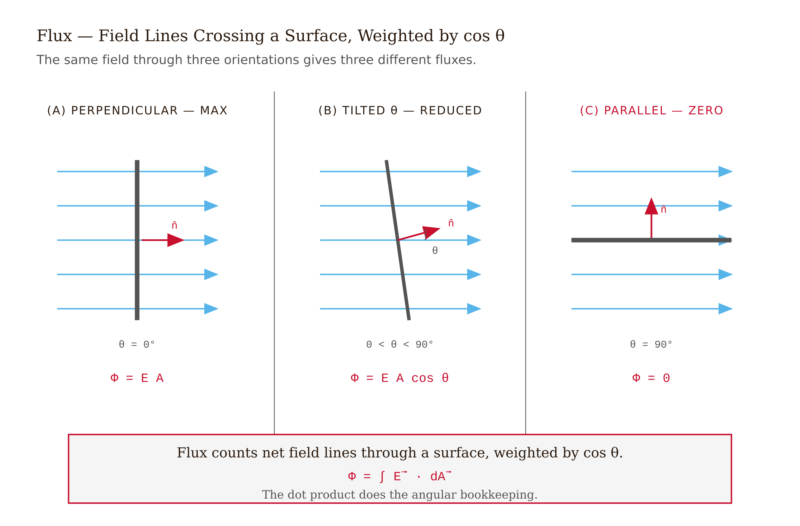
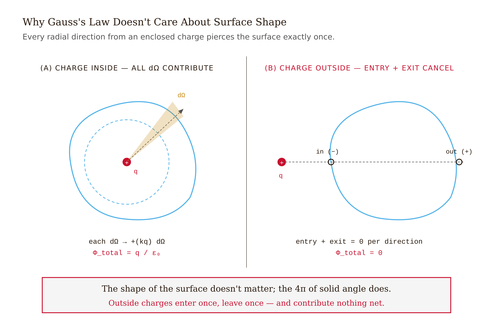
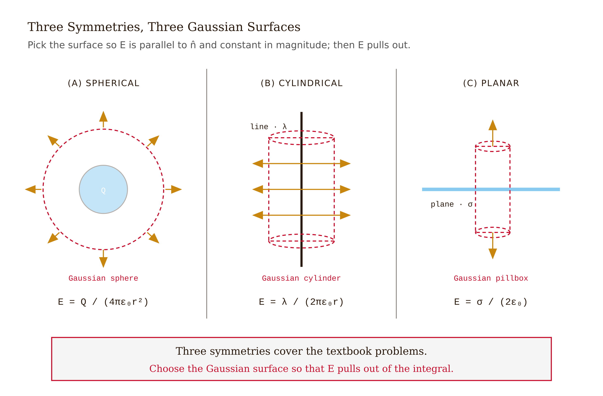
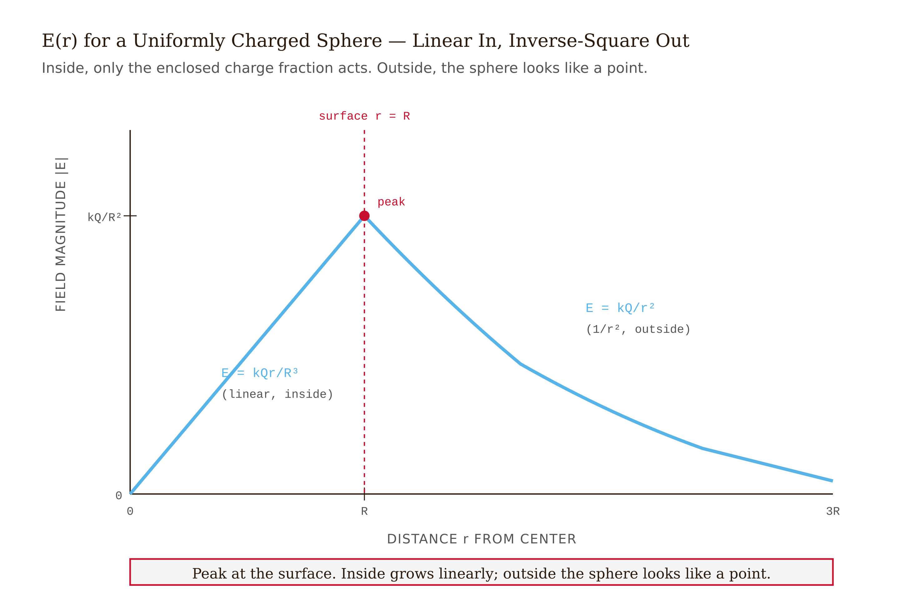
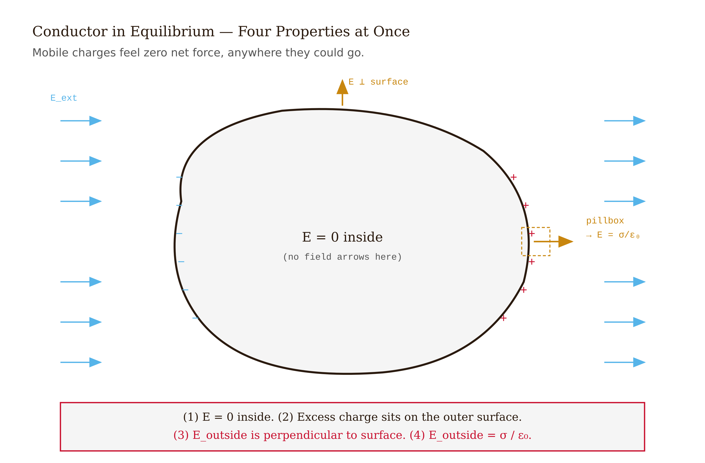
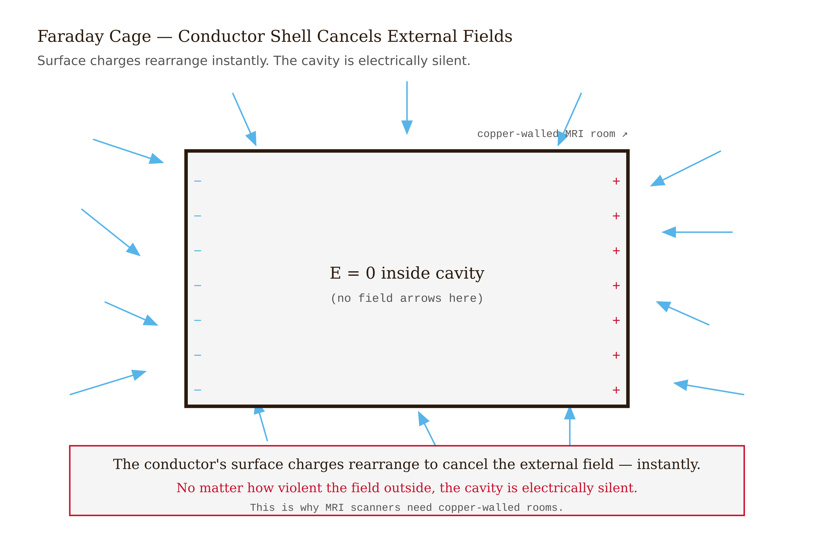

# Chapter 3 — Gauss's Law

*The first of Maxwell's equations, and the fastest tool in electrostatics.*

---

There is a room at Massachusetts General Hospital, and at every major hospital that runs clinical MRI, that is built like a copper box. The walls contain copper sheet or copper mesh. The door has a copper gasket. The windows have copper screening embedded in the glass. The patient and the machine sit inside; everything else — every cell-phone transmission, every FM broadcast, every flicker of fluorescent-lamp electronics in the building — is outside.

The machine inside is reading radio-frequency signals from precessing hydrogen nuclei in human tissue. Those signals arrive at the receiver coil at a few microvolts. The interference outside the room is hundreds of millions of times stronger. The copper box attenuates it by 80 to 120 decibels in the MRI band — a factor of $10^8$ to $10^{12}$ in power.

The physics that makes this work is called the Faraday cage. And the Faraday cage is one consequence of Gauss's law.

That's what this chapter is about. Not primarily the MRI room — that's the motivation. The thing itself is a relation between the electric field on any closed surface and the charge enclosed by that surface. It is the first of Maxwell's four equations. Every electric and magnetic phenomenon you will encounter for the rest of this book traces back, one way or another, to Gauss's law and its three companions.

---

## Electric flux

Before the law, we need the quantity it talks about: **electric flux**.

Take an electric field $\vec{E}$ and a surface $S$. The flux through $S$ is

$$\Phi_E = \int_S \vec{E} \cdot d\vec{A}$$

where $d\vec{A}$ is a small area element with magnitude $dA$ and direction along the outward normal to the surface. The dot product picks out the component of $\vec{E}$ perpendicular to the surface. Field lines running parallel to the surface contribute nothing to the flux — they are not crossing it.

For a **closed surface** (one that fully encloses a volume), we write the integral with a circle:

$$\Phi_E = \oint_S \vec{E} \cdot d\vec{A}$$

The convention is that $d\vec{A}$ points outward. Field lines leaving the enclosed volume count positive; field lines entering count negative.

The physical picture: flux is the net number of field lines crossing the surface, signed by direction. If you could paint field lines and count, flux is what you'd get — lines out minus lines in.

Units: flux has units of $\text{V} \cdot \text{m}$, equivalently $\text{N} \cdot \text{m}^2/\text{C}$.

*Figure 3.1 — Electric Flux*

<!-- → [IMAGE: closed surface (sphere) with arrows representing electric field lines — some exiting (positive flux, labeled red), some entering (negative flux, labeled blue), and some skimming tangentially (zero contribution, labeled gray)] -->

---

## Gauss's law

Here is the central claim:

$$\boxed{\;\oint_S \vec{E} \cdot d\vec{A} = \frac{Q_{\text{enc}}}{\varepsilon_0}\;}$$

The total electric flux through any closed surface equals the total enclosed charge divided by $\varepsilon_0$. That is all. Not the charge outside the surface, not the shape or size of the surface, not where the charge sits inside — only the total enclosed charge.

This is a remarkable statement. Let me show you why it is true, and then show you what it is good for.

---

## Why it is true

Start with the simplest case: a single point charge $q$ at the origin, and a spherical Gaussian surface of radius $r$ centered on it.

On the sphere, by Coulomb's law, the electric field is radial with magnitude $kq/r^2$. The outward normal $d\vec{A}$ is also radial. So $\vec{E} \cdot d\vec{A} = (kq/r^2)\,dA$ everywhere on the sphere. Integrating over the sphere's surface area $4\pi r^2$:

$$\Phi_E = \frac{kq}{r^2} \cdot 4\pi r^2 = 4\pi k q = \frac{q}{\varepsilon_0}$$

(using $k = 1/4\pi\varepsilon_0$). Notice: the $r^2$ cancels. The $1/r^2$ falloff of the field and the $r^2$ growth of the sphere's area are exactly inverse. This isn't a coincidence — it is precisely because the inverse-square law holds that the flux is independent of the sphere's radius.

Now suppose we deform the sphere into some lopsided, arbitrarily shaped closed surface still enclosing the same charge. Does the flux change?

No. Here is why. Every radial direction from $q$ passes through any enclosing surface at exactly one point. Consider the contribution to the flux from a narrow cone — a solid angle $d\Omega$ — centered on that direction. The field strength falls as $1/r^2$, but the area of the surface element the cone intercepts grows as $r^2$ (where $r$ is the distance to that part of the surface). The product, and therefore the flux contribution, is independent of $r$. Integrate over all solid angles — $4\pi$ steradians for a closed surface enclosing the charge — and you get $q/\varepsilon_0$ regardless of the surface's shape.

What about a charge *outside* the surface? Every field line from an external charge that enters the surface must also exit it. Each entry contributes negative flux; each exit contributes equal positive flux. Net contribution: zero.

Superposition does the rest. For any collection of charges, the field is the vector sum of individual Coulomb fields. The flux is the sum of individual fluxes. Only the charges inside contribute; outside charges cancel. Total flux: $Q_{\text{enc}}/\varepsilon_0$.

The whole derivation uses two ingredients: the inverse-square law and superposition. Those are the load-bearing pillars. If either failed, Gauss's law would fail with it.

*Figure 3.2 — Solid-Angle Argument*

<!-- → [IMAGE: solid-angle diagram — cone from origin charge q intersecting first a nearby spherical surface (small area, close in) and then a larger deformed surface (larger area, farther out) — annotations showing r² area growth and 1/r² field falloff exactly canceling] -->

---

## Using Gauss's law to find fields

Gauss's law is always true. It is useful as a *computational tool* only when the charge distribution has enough symmetry that you can pull $|\vec{E}|$ outside the flux integral.

The skill — and this is genuinely a skill that takes practice — is symmetry recognition. There are three symmetries where Gauss's law turns what would otherwise be a difficult three-dimensional vector integral into two lines of algebra.

**Spherical symmetry.** The charge distribution depends only on distance from a center point. Choose a spherical Gaussian surface of radius $r$ centered on that point. Symmetry forces $\vec{E}$ to be radial and constant in magnitude on the sphere. The flux integral becomes $E(r) \cdot 4\pi r^2$.

$$E(r) \cdot 4\pi r^2 = \frac{Q_{\text{enc}}}{\varepsilon_0} \implies E(r) = \frac{Q_{\text{enc}}}{4\pi\varepsilon_0 r^2} = \frac{kQ_{\text{enc}}}{r^2}$$

**Cylindrical symmetry.** Distribution depends only on perpendicular distance from an infinite axis. Choose a cylindrical Gaussian surface, coaxial with that axis, radius $r$, length $L$. The curved surface has $\vec{E}$ radial and constant; the flat endcaps have $\vec{E}$ parallel to the cap, contributing zero.

$$E(r) \cdot 2\pi r L = \frac{\lambda L}{\varepsilon_0} \implies E(r) = \frac{\lambda}{2\pi\varepsilon_0 r}$$

where $\lambda$ is the charge per unit length.

**Planar symmetry.** Distribution depends only on perpendicular distance from an infinite plane. Choose a pillbox — a short cylinder pierced through the plane. The two flat caps contribute $EA$ each; the curved side contributes nothing.

$$2EA = \frac{\sigma A}{\varepsilon_0} \implies E = \frac{\sigma}{2\varepsilon_0}$$

where $\sigma$ is the surface charge density.

In each case the computational trick is the same: choose your Gaussian surface so that $\vec{E}$ is either parallel to the normal and constant in magnitude (contributing $E \cdot A$) or perpendicular to the normal (contributing zero). Then $E$ pulls out of the integral and you do arithmetic.

<!-- → [TABLE: three Gauss-law symmetries — columns: symmetry type, example distribution, Gaussian surface shape, result for E(r)] -->

*Figure 3.3 — Three Symmetry Templates for Gauss's Law*

<!-- → [INFOGRAPHIC: three-panel side-by-side showing the three symmetry cases — (1) sphere with radial arrows and spherical Gaussian surface, (2) infinite line with cylindrical Gaussian surface and radial arrows, (3) infinite plane with pillbox Gaussian surface and perpendicular arrows — each panel labeled with its E(r) result] -->

What about a cube of uniform charge density? No useful Gaussian surface exists. The field has no simple direction relationship to the cube's faces. Gauss's law is still true for any closed surface around the cube — but it won't help you find $\vec{E}$ at an arbitrary point. You fall back on direct integration, or on numerical methods. This is not a failure of Gauss's law; it is a fact about what symmetry is required.

---

## Worked example: a uniformly charged solid sphere

A solid insulating sphere of radius $R$, total charge $Q$, uniform volume density $\rho = Q/(\frac{4}{3}\pi R^3)$. Find $\vec{E}$ everywhere.

**Symmetry.** Spherical. Gaussian surface: sphere of radius $r$, same center.

**Outside: $r > R$.** The Gaussian sphere encloses all charge $Q$.

$$E(r) \cdot 4\pi r^2 = Q/\varepsilon_0 \implies E(r) = \frac{kQ}{r^2}$$

From outside, the sphere looks exactly like a point charge at its center. This is a theorem, not an approximation — Gauss's law makes it exact for spherical symmetry.

**Inside: $r < R$.** The Gaussian sphere encloses only the charge within radius $r$:

$$Q_{\text{enc}}(r) = \rho \cdot \frac{4}{3}\pi r^3 = Q\,\frac{r^3}{R^3}$$

Apply Gauss's law:

$$E(r) \cdot 4\pi r^2 = \frac{Qr^3}{\varepsilon_0 R^3} \implies E(r) = \frac{kQr}{R^3}$$

Linear in $r$ inside. Zero at the center.

**The profile.** $E(r)$ rises linearly from zero at the center to a maximum $kQ/R^2$ at the surface, then falls as $1/r^2$ outside. There is a kink at the surface but no discontinuity in $E$ itself.

What would have been required without Gauss's law? A direct integration of $d\vec{F}$ contributions from every volume element of the sphere — an integral that requires significant setup even in spherical coordinates. Gauss's law collapses it to two lines. That compression is the whole point.

*Figure 3.4 — Electric Field Profile for a Uniformly Charged Solid Sphere*

<!-- → [CHART: E(r) vs. r for the uniformly charged solid sphere — linear rise inside from 0 to kQ/R² at r=R, then 1/r² falloff outside; kink at r=R labeled; student should see the piecewise structure] -->

---

## Conductors in electrostatic equilibrium

A conductor is a material where charges can move freely. In **electrostatic equilibrium** — the state where no charges are actually moving — four properties follow from Gauss's law combined with the requirement that mobile charges feel no net force.

**First: $\vec{E} = 0$ everywhere inside the conductor.** If $\vec{E}$ were nonzero inside, the mobile charges would feel a force and move. They stop moving only when the field is zero. Equilibrium requires $\vec{E} = 0$ throughout the bulk.

**Second: all net charge lives on the surface.** Choose any closed Gaussian surface entirely inside the conductor material. Since $\vec{E} = 0$ on that surface, the flux is zero, so $Q_{\text{enc}} = 0$. Whatever charge you put on the conductor, it goes to the surface. There is no mechanism to sustain charge in the interior.

**Third: just outside the surface, $\vec{E}$ is perpendicular to the surface.** Any tangential component would drive surface charges along the surface. Equilibrium forbids it.

**Fourth: just outside, $E = \sigma/\varepsilon_0$.** Apply a Gaussian pillbox at the surface: one cap is just outside (field $E$ pointing outward), one cap is just inside (field zero). Flux through the pillbox: $EA = \sigma A/\varepsilon_0$, so $E = \sigma/\varepsilon_0$. Note this is twice the result for an isolated infinite plane, because here *all* the flux is on the outside.

*Figure 3.5 — Conductor in Electrostatic Equilibrium*

<!-- → [IMAGE: Gaussian pillbox at the surface of a conductor — one cap inside (E=0, labeled), one cap outside (E=σ/ε₀, labeled), charge density σ on the surface, arrows showing outward flux only on the exterior cap] -->

*Figure 3.6 — Faraday Cage*

<!-- → [IMAGE: cross-section of a conducting shell with a cavity — left panel: no charge in cavity, field lines shown outside but interior is blank (E=0 labeled); right panel: point charge +q inside cavity, field lines in cavity and induced -q on inner wall, +q on outer wall, field lines outside — student should see the asymmetry between inward and outward shielding] -->

Now the MRI room. The copper walls are a closed conducting shell. Place no charge inside the cavity. Any external field — no matter how strong — drives rearrangement of surface charges on the outer surface of the conductor until those induced charges exactly cancel the external field inside the conductor material. The field inside the conductor is zero. By the same Gaussian surface argument, there is no field in the cavity either. The interior is completely shielded.

Place a charge *inside* the cavity: the situation changes. The conductor's inner surface charges rearrange to ensure $\vec{E} = 0$ in the conductor material, but now the cavity itself has a nonzero field governed by the enclosed charge. Shielding works outward (external fields cannot reach in) but not inward (internal charges produce fields that propagate out through induced surface charges). A transmitter inside a Faraday cage can still be detected outside it.

---

## Common misconceptions

**"Gauss's law only works for symmetric distributions."** Gauss's law is always true. Symmetry only determines whether it is a useful *computational shortcut* for finding $\vec{E}$. For any closed surface around any charge distribution, the flux equals $Q_{\text{enc}}/\varepsilon_0$. What symmetry buys you is the ability to pull $E$ out of the integral.

**"The Gaussian surface must coincide with a physical surface."** No. The Gaussian surface is a mathematical construct — a closed boundary you draw in space. It has no physical reality. You can put it anywhere, through anything, at any size. The law holds for all of them.

**"A charge outside the surface produces no field inside."** False. The external charge's field is nonzero everywhere, including inside the surface. What is zero is the *net flux of its field through the closed surface* — each field line that enters also exits, and the signed contributions cancel. The field is present; the net flux is not.

**"In a conductor with a cavity, $\vec{E}$ in the cavity is always zero."** Only if the cavity contains no charge. Put a charge inside and the field in the cavity is nonzero — the conductor shields the exterior from the interior, but not the interior from itself.

---

## Exercises

**Warm-up 1.** *(Flux concept — tests: physical meaning of $\Phi_E$)* A uniform electric field $\vec{E} = E_0\,\hat{x}$ points in the $+x$ direction. A flat square surface of area $A$ is oriented three ways: (a) normal parallel to $\hat{x}$, (b) normal parallel to $\hat{y}$, (c) normal at 45° to $\hat{x}$. Compute the flux through the surface in each case. Explain in one sentence why case (b) gives the answer it does.

**Warm-up 2.** *(Gauss's law — direct statement)* State Gauss's law in one equation and in one plain-English sentence. Then answer: does the flux through a closed surface depend on (a) the shape of the surface, (b) the size of the surface, (c) where the enclosed charge sits inside the surface, (d) the presence of charges outside the surface? For each: yes or no, and one sentence of justification.

**Warm-up 3.** *(Symmetry diagnosis — no calculation)* For each charge distribution below, name the symmetry (spherical / cylindrical / planar / none) and the Gaussian surface you would choose. If no useful symmetry exists, say so and explain why. (a) A uniformly charged thin spherical shell. (b) An infinite straight wire of uniform linear charge density. (c) Two parallel infinite planes with equal and opposite uniform surface charge. (d) A short, finite rod of charge. (e) A solid cube of uniform charge density.

**Application 1.** *(Spherical symmetry)* A thin spherical shell of radius $R$ carries total charge $Q$ uniformly distributed. Use Gauss's law to find $\vec{E}$ at (a) $r > R$ and (b) $r < R$. The result for $r < R$ surprises many students — explain physically why it must be zero, without invoking Gauss's law directly. (Hint: think about what every element of the shell is doing to the interior.)

**Application 2.** *(Cylindrical symmetry)* An infinite coaxial cable has an inner conductor of radius $a$ carrying uniform linear charge $+\lambda$ and an outer conducting shell of inner radius $b$ carrying $-\lambda$. Find $\vec{E}$ in the three regions $r < a$, $a < r < b$, and $r > b$. Sketch $E(r)$ as a function of $r$. In which region is the cable "working" as intended — i.e., confining the field — and what would go wrong if the outer conductor carried $+\lambda$ instead of $-\lambda$?

**Application 3.** *(Conductor in equilibrium)* A solid conducting sphere of radius $R$ carries net charge $+Q$. A thin spherical shell of radius $2R$ centered on the same point carries net charge $-3Q$. Find $\vec{E}$ in the three regions $r < R$, $R < r < 2R$, $r > 2R$, and find the charge on the inner and outer surfaces of the shell.

**Synthesis 1.** *(Inside a non-uniform sphere)* A solid insulating sphere of radius $R$ has a volume charge density that varies as $\rho(r) = \rho_0 (r/R)$ — it's denser at the surface than at the center. Find the total charge $Q$ on the sphere, then find $\vec{E}$ at arbitrary $r < R$ and $r > R$. Express both results in terms of $\rho_0$ and $R$.

**Synthesis 2.** *(Superposition of planes)* Two infinite planes of uniform surface charge density $+\sigma$ and $-\sigma$ are parallel, separated by distance $d$. Use the planar Gauss result ($E = \sigma/2\varepsilon_0$ per plane) and superposition to find $\vec{E}$ in the three regions: left of both planes, between the planes, right of both planes. Verify that the field between the planes is $\sigma/\varepsilon_0$ and the field outside is zero. This is the parallel-plate capacitor — Chapter 4 returns to it.

**Challenge.** *(Earnshaw's theorem)* Prove that no arrangement of static point charges can produce a stable equilibrium for a test charge in free space. Stability at a point requires that any small displacement produces a restoring force — in all three directions simultaneously. The force on a test charge $q$ is $\vec{F} = q\vec{E}$. A restoring force in all directions requires $\nabla \cdot \vec{F} < 0$ at the equilibrium point. But in free space (no charge at the equilibrium point), Gauss's law in differential form gives $\nabla \cdot \vec{E} = \rho/\varepsilon_0 = 0$. The contradiction is the proof.

---

## LLM Exercises

### Build the Gaussian-surface flux visualizer (`03-gauss-law.html`)

> **Show.** Gauss's law: $\oint \vec{E} \cdot d\vec{A} = Q_{\text{enc}}/\varepsilon_0$. I want to drop a Gaussian surface (a circle in 2D) into a field, move and resize it, and watch the numerical flux match the analytical prediction.
>
> **Say.** Build a Gaussian-surface flux visualizer.
>
> **Constrain.** D3 v7. Charge palette: place point charges anywhere on the canvas, set magnitude and sign via sliders. Field-line view (computed by RK4) overlaid. A draggable, resizable circle represents the Gaussian surface (a 2D cross-section of a sphere). Compute the line integral $\oint \vec{E} \cdot \hat{n} \, d\ell$ around the boundary numerically (sample 200 points). Display the result alongside the theoretical $Q_{\text{enc}}/\varepsilon_0$ for comparison. Arrow vectors at sample points on the surface, colored by their dot-product sign (red = outward flux, blue = inward). Filename: `03-gauss-law.html`.
>
> **Verify.** (a) Surface enclosing only $+q$: $\Phi_E = q/\varepsilon_0$ regardless of surface size. (b) Surface enclosing $+q$ and $-q$: $\Phi_E \approx 0$. (c) Surface enclosing no charges (charges outside the surface): $\Phi_E \approx 0$ within numerical noise.

### Exploration

- Place a single positive charge. Move the Gaussian surface around. Does the flux ever change? When does it jump?
- Put two equal positive charges side by side. Position the Gaussian surface to enclose just one of them. What flux do you measure?
- Place a $+q$ at the center of the surface and add a $-q$ far away (still inside the surface). The flux should be zero — verify.

### Extension prompt (chapter bridge)

> **Show.** Gauss's law gives me $\vec{E}$ from symmetric distributions. Now I want a scalar quantity that's even easier to compute — the electric potential $V$, where $\vec{E} = -\nabla V$.
>
> **Say.** Modify the visualizer to show $V(x, y)$ as a color-mapped background and equipotential contour lines.
>
> **Constrain.** Compute $V(x,y) = \sum_i k q_i / r_i$ at each grid point. Render as a heatmap (red = high, blue = low) with green dashed equipotential contours via `d3.contours()`. Verify that the existing electric-field arrows point from high-$V$ regions to low-$V$ regions and are perpendicular to the equipotential contours.
>
> **Verify.** Visual check: $\vec{E}$ arrows are perpendicular to equipotentials everywhere; flow runs downhill from red regions to blue regions.

Save as `03b-potential-preview.html`. This is the lead-in to Chapter 4.

---

## What would change my mind

Gauss's law rests on (a) the inverse-square law and (b) superposition. The exponent in the inverse-square law has been verified to be 2 within a part in $10^{16}$ in laboratory tests (Williams, Faller & Hill, 1971). A confirmed deviation from inverse-square at any scale where Coulomb's law currently holds would require a rewriting of this chapter. Some theories propose tiny deviations at sub-millimeter scales related to extra spatial dimensions; experimental searches have placed strong bounds, and none has found a deviation.

## Still puzzling

*Magnetic monopoles.* Gauss's law for $\vec{B}$ — Maxwell's second equation — reads $\oint \vec{B} \cdot d\vec{A} = 0$ for any closed surface. The right-hand side is identically zero because no magnetic charges have ever been observed. Dirac showed in 1931 that a single magnetic monopole, if it existed anywhere in the universe, would explain why electric charge is quantized. The connection is elegant. No monopole has been detected.

*Shielding asymmetry.* The Faraday cage blocks external fields from reaching the interior but does not prevent internal sources from influencing the exterior — the induced surface charges caused by an interior charge produce a field outside. This asymmetry is rarely remarked on in introductory treatments. It is worth sitting with.

*Gauss's law in curved spacetime.* In general relativity, the surface-integral form requires generalization. The spirit survives, but the geometry is more involved. We will not go there in this book.

---

**Tags:** Gauss's law, flux, Gaussian surface, conductor, Faraday cage, Earnshaw's theorem, symmetry, Maxwell equation #1
