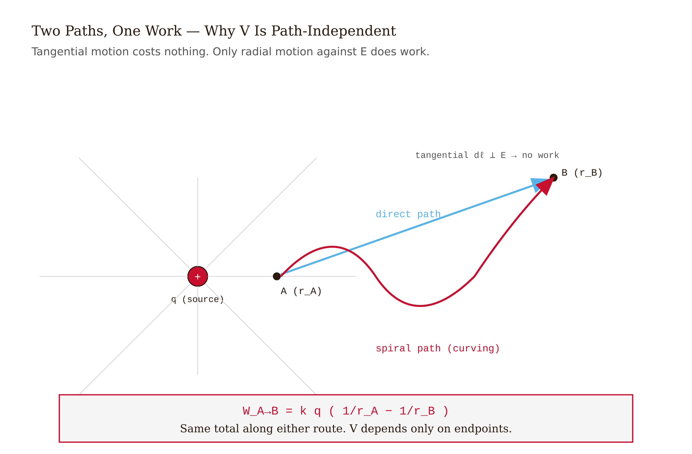
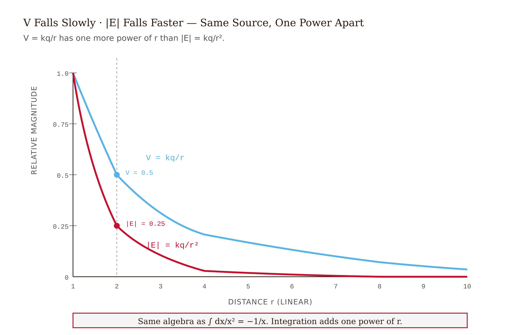
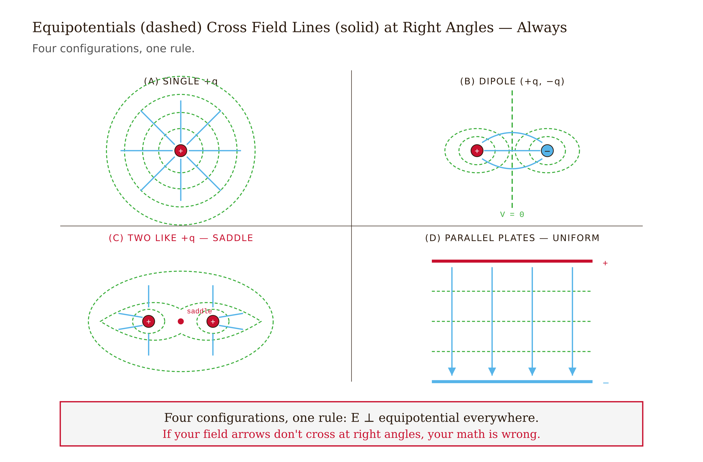
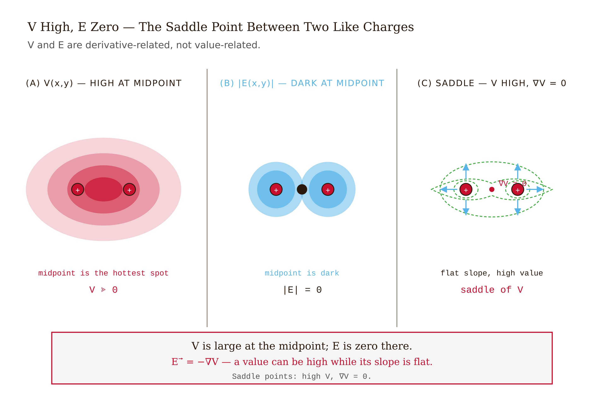
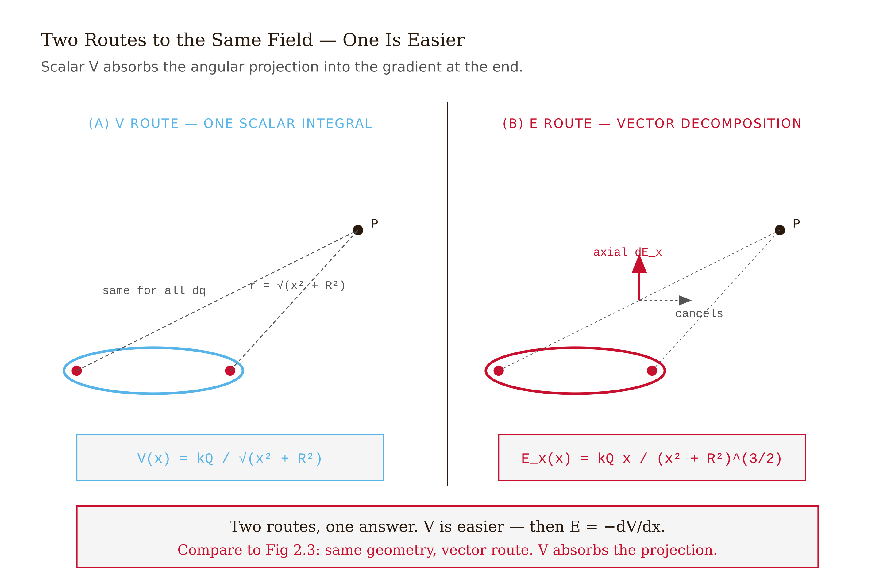
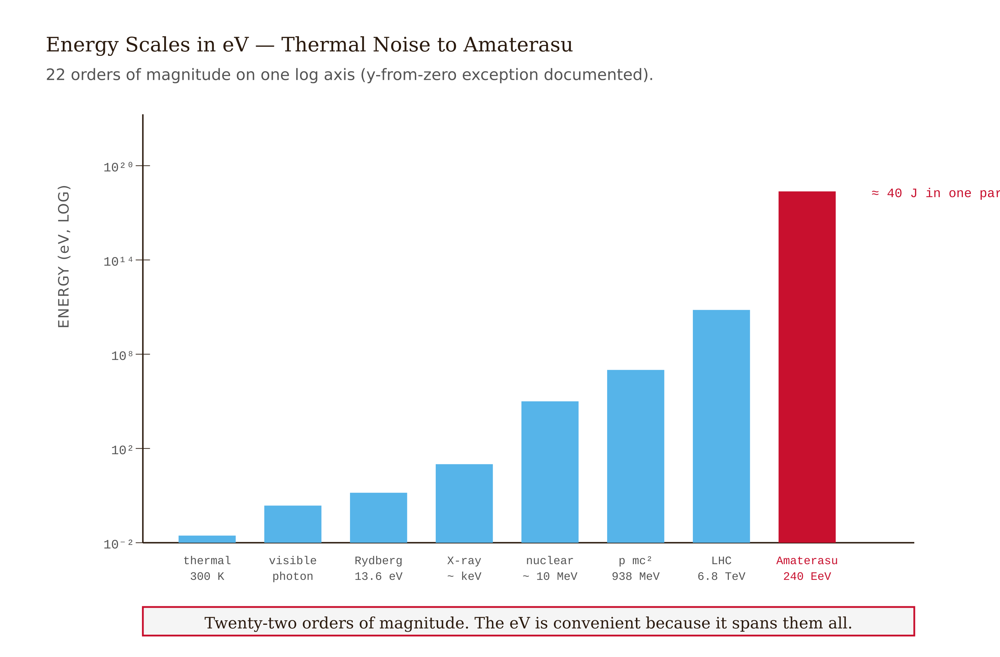

# Chapter 4 — Electric Potential

*The scalar shortcut to the electric field, and the energy that lives in a difference of volts.*

---

On 20 March 1800, Alessandro Volta wrote a letter to Sir Joseph Banks, President of the Royal Society in London, describing a device he had built out of alternating discs of zinc, silver, and brine-soaked cardboard. Stack the discs in a tower, touch a wire to the top and another to the bottom, and a steady current flows. No spinning glass globes, no Leyden jars, no rubbing — just chemistry holding the two ends of the stack at different electrical states.

The letter was published later that year in the *Philosophical Transactions*. The device became the voltaic pile — the first practical battery, and the ignition point of the electrical revolution that produced the telegraph, the dynamo, and eventually every battery-powered thing on the planet.

The quantity Volta's pile maintains between its terminals is the one this chapter is about. At the 1881 International Electrical Congress in Paris, the world's electricians agreed to call its SI unit the **volt** in his honor. A AA battery says "1.5 V" on the label. A wall outlet in the US is "120 V." A defibrillator paddle, "1,500 V." A high-voltage transmission line, "500 kV." The Large Hadron Collider's proton beams run at 6.8 TeV — the energy a proton acquires crossing six-and-a-half trillion volts.

Every one of those numbers names the same physical quantity: **work per unit charge**. This chapter is about what that means, why it's useful, and why a single number at each point in space turns out to contain the same information as the vector field we spent two chapters building.

---

## The problem with vectors

Chapter 2 gave us the electric field — a vector at every point in space. Chapter 3 showed us how to use it. And along the way, computing the field from any distribution of charges involves integrating vectors: you have to keep track of directions, project components, handle cancellations, and carry unit vectors through every step. It works, but it's work.

Here is the key question: **is all of that vector machinery actually necessary?**

The answer, for static fields, is no. And the reason why is one of the most useful facts in electrostatics.

---

## Path independence and why it matters

Take a test charge $q_0$ and drag it from point A to point B along some path through a static electric field. The work done by the field is

$$W_{A \to B} = q_0 \int_A^B \vec{E} \cdot d\vec{\ell}$$

Now take a completely different path between the same two points. Same start, same finish, different route.

For a static electric field, **the integral gives exactly the same answer on both paths.** Not approximately — exactly. The work done by a static electric field moving a charge between two points depends only on where you start and where you finish, not on how you get there. Equivalently, the work done on any closed loop — starting and ending at the same point — is exactly zero.

This is not obvious. Why should it be true?

Look at the simplest case: a single point charge $q$ sitting at the origin, and a test charge moving through its field. The field is radial: $\vec{E} = (kq/r^2)\hat{r}$. Decompose any path into infinitesimal pieces. Each piece has a radial component $dr$ and a tangential component perpendicular to $\hat{r}$. The field is purely radial, so it does no work on the tangential pieces — $\vec{E} \cdot d\vec{\ell} = 0$ there. Only the radial pieces contribute:

$$\int_A^B \vec{E} \cdot d\vec{\ell} = \int_{r_A}^{r_B} \frac{kq}{r^2}\, dr = kq\left(\frac{1}{r_A} - \frac{1}{r_B}\right)$$

Only the starting and ending distances appear. Everything in between dropped out. The path was irrelevant.

*Figure 4.1 — Path Independence*

<!-- → [IMAGE: diagram of a point charge at origin with two paths from point A to point B — one a curved arc, one a jagged radial-then-tangential route — with annotations showing that only r_A and r_B enter the integral, and tangential steps contributing zero — the geometric proof of path-independence made visible] -->

By superposition, any static charge distribution is a sum of point charges. Each one is path-independent. The sum is path-independent. **Every static electric field is path-independent.**

In the language of vector calculus, a path-independent vector field has zero curl everywhere: $\nabla \times \vec{E} = 0$. And a theorem of vector calculus says that whenever the curl of a field vanishes on a simply connected region, the field must be the *gradient* of some scalar function. We call that scalar function $V$ and give it a sign:

$$\boxed{\;\vec{E} = -\nabla V\;}$$

The minus sign is convention. It's chosen so that positive charges "roll downhill" in $V$, just as rocks roll downhill in gravitational potential.

*Figure 4.2 — V Falls as 1/r, E Falls as 1/r squared*

<!-- → [INFOGRAPHIC: side-by-side — left: a winding path and a straight path between two points A and B in an electric field, with integral values shown equal; right: the "landscape" picture of V as a surface, with E arrows pointing downhill perpendicular to contours — to make path-independence and the gradient connection visual simultaneously] -->

---

## What $V$ is

The **electric potential** at a point is defined as the work per unit charge that the field does moving a test charge from a reference point to that location:

$$V_A - V_B = -\int_A^B \vec{E} \cdot d\vec{\ell}$$

Units: joules per coulomb, which is one volt. One volt is one joule per coulomb of work.

The reference point is a choice. For isolated finite charge distributions, the convention is $V(\infty) = 0$ — potential vanishes at infinity. For circuit problems, you pick a "ground" and call it zero. The reference shifts $V$ everywhere by a constant, but it shifts every point by the *same* constant, so all differences $\Delta V$ are unchanged. The forces on every charge, which depend only on $\vec{E} = -\nabla V$, are completely unaffected. **Only differences in potential are physically meaningful.** There is no experiment you could perform that measures absolute $V$ — only $\Delta V$ between two locations.

This is worth sitting with. I can add a million volts to the potential at every point in this room, and nothing would change. The field would be identical. Every force on every charge would be identical. Every current through every wire would be identical. The million volts is invisible because no instrument measures potential — instruments measure *differences* in potential.

The companion quantity is **potential energy**: $U = qV$. $V$ is a property of a location in space — joules per coulomb, intensive, belongs to the field. $U$ is a property of a particular charge *at* that location — joules, extensive, belongs to the system. The two are related by one symbol: $U = qV$. Confusing them is the single most common error in this subject. Write that relation at the top of every problem until it becomes reflex.

---

## The potential of a point charge

For a single point charge $q$ at the origin, integrate $\vec{E}$ inward from infinity along a radial path, using $V(\infty) = 0$:

$$V(r) = -\int_\infty^r \frac{kq}{r'^2}\, dr' = \frac{kq}{r}$$

$$\boxed{\;V(r) = \frac{kq}{r}\;}$$

*Figure 4.3 — Equipotential Atlas for Four Canonical Configurations*

<!-- → [IMAGE: side-by-side of E field (1/r² falloff, vector arrows radiating outward) and V potential (1/r falloff, scalar value as height above a surface) for the same positive point charge — making the one-more-power-of-r relationship visually clear] -->

The potential falls as $1/r$, one power slower than the field. The reason is just calculus: integrating $1/r^2$ gives $-1/r$, which has one fewer power of $r$ in the denominator. You can run it backwards to check: $-dV/dr = -d(kq/r)/dr = kq/r^2 = E_r$. The field comes back exactly.

---

## Why scalars win

For a collection of $N$ charges $q_i$ at positions $\vec{r}_i$, the potential at field point $\vec{r}$ is:

$$V(\vec{r}) = \sum_i \frac{k q_i}{|\vec{r} - \vec{r}_i|}$$

**Every term is a scalar.** Compute a distance, divide, multiply, add. No unit vectors. No components. No projections.

Compare this to computing the field $\vec{E}$ at the same point directly. For each charge, you compute a distance — identical. Then you compute a unit vector $\hat{r}_i$ pointing from the source to the field point — three components, three multiplications. Then you project. Then you add as vectors. The vector route does roughly three times the arithmetic, with triple the chances of a sign error.

If you need $\vec{E}$, the cheaper strategy is: compute $V$ everywhere as a scalar sum, then take the gradient once at the end. The vector machinery gets deferred to one final differentiation rather than being carried through every term.

This is the chapter's payoff. Most electrostatics problems that look hard in $\vec{E}$ become arithmetic in $V$.

<!-- → [TABLE: side-by-side comparison of computing E vs. V for a two-charge configuration — columns: step, vector route (with unit vector projection), scalar route (distance and divide) — rows walking through each arithmetic operation — makes the "3× the work" claim concrete and countable] -->

---

## Equipotential surfaces

An **equipotential surface** is the set of all points where $V$ has a single value. Topographic maps work exactly this way — contour lines are level sets of altitude.

*Figure 4.4 — High V Does Not Mean High E*

<!-- → [IMAGE: topographic map analogy — contour lines of altitude on a hill, with arrows showing the steepest-descent direction (gradient) perpendicular to contours at every point — sets up equipotentials and field lines with a familiar visual before the physics version] -->

Three things follow immediately from the definition and the gradient relation.

**Moving a charge along an equipotential costs zero work.** No $\Delta V$ means no $\Delta U$. If $q$ moves on a surface of constant $V$, the field does nothing to it. This is exactly analogous to moving horizontally on a topographic map — no change in gravitational potential energy.

**Field lines are perpendicular to equipotentials.** The gradient of any scalar function always points perpendicular to its level sets — this is a theorem of multivariable calculus. Since $\vec{E} = -\nabla V$, the field vector at every point is perpendicular to the equipotential through that point. Field lines and equipotential surfaces are always at right angles.

*Figure 4.5 — Ring on Axis*

<!-- → [IMAGE: dipole field lines (solid curves from + to −) with equipotential contours (dashed curves) drawn on the same diagram, showing right-angle crossing everywhere — the visual confirmation of E = −∇V] -->

**A conductor in electrostatic equilibrium is an equipotential.** From Chapter 3: inside a conductor, $\vec{E} = 0$. If the field vanishes everywhere inside, then $\nabla V = 0$ everywhere inside, so $V$ is constant throughout. The surface of the conductor inherits that same constant value. This is why the surfaces of capacitor plates, wires, and any other conductor at equilibrium are equipotentials.

Some geometries worth picturing:

For a **single point charge**, the equipotentials are concentric spheres. They get closer together near the charge, because $V \sim 1/r$ means equal steps in $V$ require exponentially smaller steps in $r$ as you approach the source.

For an **electric dipole** ($+q$ and $-q$), the plane perpendicular to the dipole axis through the midpoint is the $V = 0$ equipotential — the two charges contribute equal and opposite amounts there. The other equipotentials wrap around each charge like distorted eggs, pinched toward the other charge.

For two **equal positive charges**, the equipotentials are roughly spherical far away (the pair looks like $2q$ from a distance). Close in, two separate surfaces bulge around each charge, connected through a saddle point on the line between them where $\vec{E} = 0$.

The simulation at the end of this chapter draws all of these live. Once you see equipotential contours and field arrows on the same canvas — arrows always crossing contours at right angles — the gradient relation stops being abstract and becomes something you can see.

---

## Getting $\vec{E}$ back from $V$

In Cartesian coordinates:

$$\vec{E} = -\nabla V = -\left(\frac{\partial V}{\partial x}\hat{x} + \frac{\partial V}{\partial y}\hat{y} + \frac{\partial V}{\partial z}\hat{z}\right)$$

In problems with one-dimensional symmetry — $V$ depending only on $r$, or only on $x$ — this reduces to a single derivative:

$$E_r = -\frac{dV}{dr}, \qquad \text{or} \qquad E_x = -\frac{dV}{dx}$$

The simulation uses the numerical version. At each grid point, central differences approximate the partial derivatives:

$$\frac{\partial V}{\partial x}(x, y) \approx \frac{V(x+h, y) - V(x-h, y)}{2h}$$

This is second-order accurate in the step size $h$. The visual test: every field arrow on the canvas should cross the nearest equipotential contour at a right angle. When it doesn't, the gradient code is wrong. Geometry is the debugger.

---

## Worked example: the axis of a charged ring

A ring of radius $R$ carries total charge $Q$ distributed uniformly. Find $V$ and $E_x$ at a point on the symmetry axis at distance $x$ from the center.

**Place the ring in the $yz$-plane**, centered at the origin. The field point is at $(x, 0, 0)$.

**Key observation.** Pick any element $dq$ on the ring. Its distance to the axial field point is

$$r = \sqrt{x^2 + R^2}$$

This is the same for every element — they all sit at the same perpendicular distance $R$ from the axis, at the same axial distance $x$ from the field point.

**The integral collapses.** Since $r$ is constant across the ring, it comes out of the integral entirely:

$$V(x) = \int \frac{k\, dq}{r} = \frac{k}{\sqrt{x^2 + R^2}} \int dq = \frac{kQ}{\sqrt{x^2 + R^2}}$$

One line. Compare this to the Chapter 2 vector route, where we had to identify which components cancel (the transverse ones), project the surviving axial component with $\cos\theta = x/r$, and integrate. The potential route required none of that — the scalar doesn't have directions to project.

**Differentiate to get the field:**

$$E_x = -\frac{dV}{dx} = \frac{kQx}{(x^2 + R^2)^{3/2}}$$

The same answer as Chapter 2. The angular bookkeeping — the $\cos\theta$ factor — got absorbed into the chain rule automatically.

**Limits.** At the center ($x = 0$): $V = kQ/R$, $E_x = 0$. The potential is large and finite; the field vanishes by symmetry. This is a clean example of the point worth laboring: $V$ and $E$ at a point have no fixed value-to-value relationship. Only the *derivative* of $V$ gives $E$.

At $x \gg R$: $V \to kQ/x$, $E_x \to kQ/x^2$. The ring looks like a point charge from far away.

*Figure 4.6 — Electron-Volt Energy Scales*

<!-- → [IMAGE: diagram showing the ring in the yz-plane with the axial field point at distance x, the uniform distance r = √(x² + R²) from every ring element to the field point labeled, and the absence of any component decomposition — to contrast visually with the Chapter 2 vector diagram for the same geometry] -->

---

## Continuous distributions and Poisson's equation

For any continuous charge distribution, the potential is:

$$V(\vec{r}) = k \int \frac{dq}{|\vec{r} - \vec{r}'|}$$

A scalar integral — one number per field point. For distributions that don't have enough symmetry for Gauss's law to crack open the field directly, this integral is often the only tractable route. Compute $V$ everywhere as a scalar field, then take the gradient to get $\vec{E}$.

Combining the gradient relation with Gauss's law gives a single equation connecting everything:

$$\nabla \cdot \vec{E} = -\nabla^2 V = \rho/\varepsilon_0$$

$$\boxed{\;\nabla^2 V = -\rho/\varepsilon_0\;}$$

This is **Poisson's equation**. In a charge-free region, $\rho = 0$ and it becomes $\nabla^2 V = 0$ — **Laplace's equation**. Every electrostatics problem involving conductors held at fixed potentials reduces to solving Laplace's equation with appropriate boundary conditions. The analytic and numerical techniques for this reduction constitute most of an intermediate electromagnetism course. We name the equation here, plant the flag, and move on.

<!-- → [INFOGRAPHIC: hierarchy diagram showing the logical chain — charge distribution ρ → Poisson's equation → V(r) → gradient → E(r) → force on test charge — with the two special cases labeled: Poisson when ρ ≠ 0, Laplace when ρ = 0 — one visual that shows where everything in the chapter sits in the larger framework] -->

---

## The electron-volt

When the system of interest is a single charge moving across a potential difference, the natural energy unit is not the joule — it's the energy one elementary charge gains crossing one volt:

$$1\text{ eV} = 1.602176634 \times 10^{-19}\text{ J}$$

This is now exact. In the 2019 redefinition of SI units, the elementary charge $e$ was *defined* to equal $1.602176634 \times 10^{-19}$ C, so the eV became a defined conversion factor.

<!-- → [TABLE: energy scales in eV — rows: thermal energy at room temperature (kT ≈ 0.026 eV), visible photon (1.8–3.1 eV), hydrogen ionization energy (13.6 eV), X-ray photon (~keV), nuclear binding per nucleon (~8 MeV), proton rest mass (938 MeV), LHC beam per proton (6.8 TeV), Amaterasu cosmic ray (~2.4 × 10²⁰ eV) — to show the 22-order-of-magnitude span of one unit] -->

The range is extraordinary. Twenty-two orders of magnitude from the thermal jiggling of a room-temperature molecule to the most energetic particle ever detected.

That last entry — the Amaterasu particle, announced by the Telescope Array collaboration in *Science* in 2023 — had a kinetic energy of roughly $2.4 \times 10^{20}$ eV, or about 40 joules, the energy of a baseball thrown by a major-league pitcher, concentrated in a single subatomic particle. Where it came from is not yet known.

---

## Three misconceptions worth naming

**"High $V$ means high $E$."** This is wrong, and the counterexample is sitting in the worked example above. At the center of a uniformly charged ring, the potential is $kQ/R$ — large and positive. The field there is exactly zero. The potential has a local maximum at the center; the field is its gradient, and the gradient of a local maximum is zero at the maximum. $V$ at a point tells you nothing about $\vec{E}$ at that point. Only the spatial *variation* of $V$ matters.

**"$V$ is zero where there is no charge."** No. The potential at a point depends on all charges everywhere, weighted by distance. The point at the center of an empty room, with a charged sphere outside, has a perfectly well-defined nonzero potential. The only place $V$ is automatically zero is the reference point — and that was your choice.

**"Equipotentials and field lines are the same."** They are always perpendicular — never parallel. Field lines run *across* equipotentials, in the direction of steepest descent of $V$. The confusion between them is so common in introductory physics that physics education researchers have explicitly documented it as a persistent failure mode. The cure is the simulation: once you see field arrows crossing equipotential contours at right angles on the live canvas, the relationship is no longer abstract.

<!-- → [IMAGE: two-panel "misconception vs. reality" — left panel shows a student's incorrect sketch of field lines running along equipotentials, right panel shows the correct diagram with field lines perpendicular to equipotentials, both for a dipole — makes the common error explicit so students recognize it] -->

---

## Why the curl vanishes, and when it doesn't

I want to be honest about something. The path-independence we derived holds only for *static* fields. The argument rested on the radial form of the Coulomb field — and that form is only exactly right when the charges are sitting still.

In Chapter 10, we will find Faraday's law: when a magnetic field changes with time, it produces an electric field whose curl is *not* zero:

$$\nabla \times \vec{E} = -\frac{\partial \vec{B}}{\partial t}$$

In that situation, the work done by the electric field on a charge going around a loop is not zero. It is, in fact, the EMF that drives current in a transformer, a generator, and every electric motor. The gradient relation $\vec{E} = -\nabla V$ breaks down — or rather, it needs to be extended with a vector potential companion to stay consistent.

For now: electrostatics, curl-free field, scalar potential sufficient. The extension to time-varying fields is Chapter 10. Everything we build here carries over — but the picture will need to widen.

---

## The field is still there

Here is something that puzzled me when I first encountered the potential: if I can describe everything with a scalar $V$, what happened to the field?

The field didn't go anywhere. $\vec{E} = -\nabla V$ — the field is the spatial variation of $V$. $V$ is a compressed representation of $\vec{E}$, not a replacement. The vector information — three components at every point — is encoded in the derivatives of one scalar function.

This encoding is only lossless because of the gradient structure. You can recover $\vec{E}$ from $V$ by differentiating, but you cannot recover $V$ from $\vec{E}$ without integrating along a path *and* specifying a reference. The two representations carry equivalent physical content, but $V$ is the cheaper one to compute with.

In classical electrostatics, the two formulations are genuinely equivalent. But the potential formulation turns out to be the one that generalizes — to quantum mechanics (where it appears directly in the Schrödinger equation), to the Aharonov-Bohm effect (where it influences particle behavior in regions where $\vec{E} = 0$ but $V \neq$ constant), and to relativistic field theory (where the four-potential is the natural object). The fact that $V$ starts out looking like a computational shortcut and ends up being the more fundamental object is one of the small surprises of the subject.

<!-- → [INFOGRAPHIC: "ladder of formulations" — classical E&M (E field) → potential V → quantum mechanics (Schrödinger equation with V) → Aharonov-Bohm (V in field-free region) → relativistic QFT (four-potential) — each rung labeled with what V becomes and why the potential formulation survives each generalization where the field formulation needs extension] -->

---

## Exercises

**Warm-up.** Define electric potential $V$ in one sentence using only the words "work," "charge," and "point." Then define potential energy $U$ in one sentence. State the relation between them in one symbol. Finally: explain in a sentence why a region of space can have $V = 10^6$ V without anything dramatic happening to a charge placed there. *Tests: operational definitions, V vs. U distinction, significance of reference.*

**Warm-up.** Two charges sit on the $x$-axis: $+2$ nC at $x = 0$ and $-3$ nC at $x = 4$ cm. Compute $V$ at the point $(2\text{ cm},\, 3\text{ cm})$. Take $V(\infty) = 0$ and report in volts. Then identify whether a positive test charge placed at that point would tend to move toward higher or lower $x$ — and explain how you know without computing the field directly. *Tests: scalar superposition, sign convention, connecting V gradient to force direction.*

**Warm-up.** On the axis of a uniformly charged ring of radius $R = 5$ cm and total charge $Q = 10$ nC, find (a) $V$ at $x = 0$, (b) $V$ at $x = 10$ cm, (c) $E_x$ at $x = 10$ cm by differentiating your expression for $V(x)$. Use $k = 8.99 \times 10^9$ N·m²/C². *Tests: applying the ring result, recovering E from V via differentiation.*

**Application.** An electron is accelerated from rest through a potential difference of 25 kV (a vintage television picture tube). (a) What is its kinetic energy in joules? In eV? (b) What is its speed, treating it non-relativistically? (c) Express that speed as a fraction of $c = 3 \times 10^8$ m/s. Should you have used the relativistic formula? How do you know? *Tests: U = qV, unit conversion to eV, reality-check on non-relativistic approximation.*

**Application.** Three charges sit at the vertices of an equilateral triangle of side $a = 10$ cm: $q_1 = +1$ nC, $q_2 = +1$ nC, $q_3 = -1$ nC. (a) Compute the total electrostatic potential energy $U$ of the configuration by summing the three pairwise terms $kq_iq_j/r_{ij}$. (b) If all three charges are simultaneously released from rest, will the system gain or lose kinetic energy as it evolves? Argue from $U$. (c) Identify which pair dominates the dynamics early on and why. *Tests: potential energy of a system, sign of U, physical interpretation.*

**Application.** The simulation in this chapter computes $E_x \approx -[V(x+h,y) - V(x-h,y)]/(2h)$. (a) Show by Taylor expansion that this central difference approximation has error $O(h^2)$ — that is, the leading error term goes as $h^2$, not $h$. (b) If you halve $h$, by what factor does the truncation error shrink? (c) Why can't you make $h$ arbitrarily small in floating-point arithmetic? *Tests: numerical differentiation, Taylor series, floating-point trade-offs.*

**Synthesis.** Show that on the axis of a uniformly charged disk of radius $R$ and total charge $Q$, the potential is

$$V(x) = \frac{Q}{2\pi\varepsilon_0 R^2}\left(\sqrt{x^2 + R^2} - |x|\right)$$

by treating the disk as a stack of nested rings of radius $r'$ and width $dr'$, each carrying charge $dQ = \sigma \cdot 2\pi r'\,dr'$ where $\sigma = Q/(\pi R^2)$, and integrating the ring result $V_\text{ring} = kQ_\text{ring}/\sqrt{x^2+r'^2}$ over $r'$ from 0 to $R$. Then differentiate to get $E_x$, and verify that as $R\to\infty$ at fixed $\sigma$, $E_x \to \sigma/(2\varepsilon_0)$ — the infinite-plane result. *Tests: using a worked example as a building block, integral technique, connection to prior chapter.*

**Synthesis.** Two infinite parallel planes face each other: $+\sigma$ at $z = 0$, $-\sigma$ at $z = d$. Using the infinite-plane field result $E = \sigma/(2\varepsilon_0)$ and superposition, find $\vec{E}$ in the three regions $z < 0$, $0 < z < d$, $z > d$. Then integrate to find $V(z)$ in each region (choose $V = 0$ at $z = 0$). Sketch $V(z)$. This is the parallel-plate capacitor — verify that your $\Delta V$ between the plates equals $Ed$. *Tests: field superposition, integrating to get V, capacitor geometry, connects to Chapter 5.*

**Challenge.** Gauss's law tells you the divergence of $\vec{E}$; the curl-free condition tells you the curl. Together they uniquely specify $\vec{E}$ given boundary conditions — this is Helmholtz's theorem. (a) State both equations for electrostatics ($\nabla \cdot \vec{E}$ and $\nabla \times \vec{E}$). (b) Substitute $\vec{E} = -\nabla V$ into the divergence equation to derive Poisson's equation $\nabla^2 V = -\rho/\varepsilon_0$. (c) In a charge-free region, Laplace's equation $\nabla^2 V = 0$ holds. Show that no local maximum or minimum of $V$ can exist in a charge-free region — a result called Earnshaw's theorem. (Hint: what does a local maximum require of the second partial derivatives? What does Laplace's equation say about their sum?) *Tests: connecting the full Maxwell structure to V, derivation of Poisson, Earnshaw's theorem by inspection.*

<!-- → [CHART: V(x) on the axis of a charged ring — normalized so R = 1 and kQ/R = 1 — showing the maximum at x = 0, the 1/x falloff at large x, and the inflection points; students should see the shape that produces E_x = 0 at center and E_x max at x = R/√2 before the differentiation exercises] -->

---

## LLM Exercises

### Build the potential-surface visualizer (`04-electric-potential.html`)

> **Show.** Electric potential of point charges: $V(\vec{r}) = \sum_i k q_i / |\vec{r} - \vec{r}_i|$. The electric field is the negative gradient: $\vec{E} = -\nabla V$. Field lines are perpendicular to equipotentials.
>
> **Say.** Build a potential-surface visualizer that color-maps $V(x, y)$, overlays equipotential contour lines, and draws $\vec{E}$ arrows as the numerical gradient of the color map.
>
> **Constrain.** D3 v7. Charge palette: drag-and-drop point charges onto the canvas; per-charge sliders for sign and magnitude (range $\pm 10$ nC). Performance OK for up to 8 simultaneous charges. Render $V(x, y)$ on a grid (~200×200) as a heatmap with red high, blue low; clip extreme values near the singularities to keep the color scale readable. Equipotential contours: use `d3.contours()` to draw level sets of $V$ in green, at evenly spaced levels. Electric field arrows: compute $\vec{E} = -\nabla V$ by central differences on the grid; draw arrows on a coarser sub-grid (e.g., 20×20) with length proportional to $|\vec{E}|$, capped for visual clarity. Toggles: (a) show/hide heatmap, (b) show/hide equipotentials, (c) show/hide field arrows. Filename: `04-electric-potential.html`.
>
> **Verify.** (a) Single $+q$: equipotentials are concentric circles, field arrows radial outward. (b) Single $-q$: equipotentials are concentric circles, field arrows radial inward. (c) Dipole ($+q, -q$): the line equidistant from both charges is a $V = 0$ equipotential; arrows cross it perpendicular to it. (d) Two equal $+q$: there is a saddle point of $V$ on the line between them where $\vec{E} = 0$ (no arrow); the equipotentials form a figure-eight pattern around the saddle. (e) **Critical visual check:** at every grid point, the field arrow should be perpendicular to the local equipotential contour. If they are not perpendicular, the gradient code is wrong.

### Exploration

- Place a single $+10$ nC charge. Sketch by eye where the $V = 100$ V equipotential should be (use $V = kq/r$ → $r = kq/V \approx 0.9$ m for these numbers). Find it on the simulation. Does the spacing of equipotentials get tighter as you approach the charge? Why?
- Place a $+q$ and a $-q$ separated by 10 cm. Find the $V = 0$ equipotential — note that it is *not* the same as the locus of zero $\vec{E}$. Explain in one sentence why.
- Place four equal $+q$ charges at the corners of a square. Identify all the points where $\vec{E} = 0$. How many are there, and which is which kind of critical point (saddle, max, min) of $V$?
- Place two $+q$ side by side. Walk a test point from far away straight toward the midpoint between them. Watch $V$ rise. Now walk perpendicular off the line. Does $V$ rise or fall? What does that tell you about the saddle geometry?

### Extension prompt (chapter bridge)

> **Show.** I've seen the potential-surface visualizer. Now I want to use $V$ to define a new device: a *capacitor*. Two conductors held at different $V$, with the ratio $C = Q/V$ characterizing how much charge sits on the plates per volt of difference.
>
> **Say.** Modify the visualizer to add a "capacitor mode": place two large parallel charged plates ($+\sigma$ and $-\sigma$) and visualize the uniform $\vec{E}$ field between them, the linearly varying $V$, and the planar equipotentials.
>
> **Constrain.** Plates are line segments on the canvas; uniform surface charge density. The $V$ heatmap should show parallel-line equipotentials between the plates. Field arrows should be uniform, perpendicular to the plates. Display a readout: $C = \varepsilon_0 A / d$ for the chosen geometry, $V = E \cdot d$, and stored energy $U = \frac{1}{2}CV^2$.
>
> **Verify.** Equipotentials are evenly spaced lines parallel to the plates. $\vec{E}$ is uniform between them and zero outside (in the idealized limit). The energy readout should equal the energy density $\frac{1}{2}\varepsilon_0 E^2$ multiplied by the volume between the plates.

Save as `04b-capacitor-preview.html`. This is the lead-in to Chapter 5.

---

**Tags:** electric potential, voltage, equipotential surface, gradient, electron-volt, Poisson equation, Volta, scalar superposition
