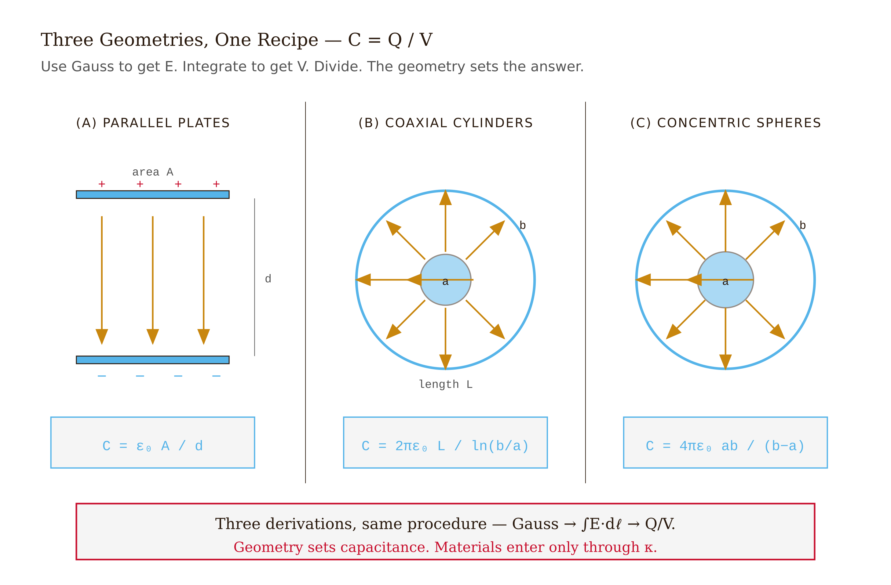
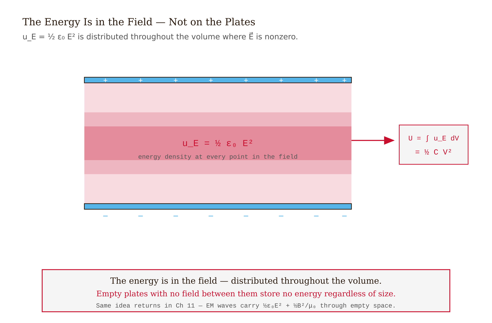
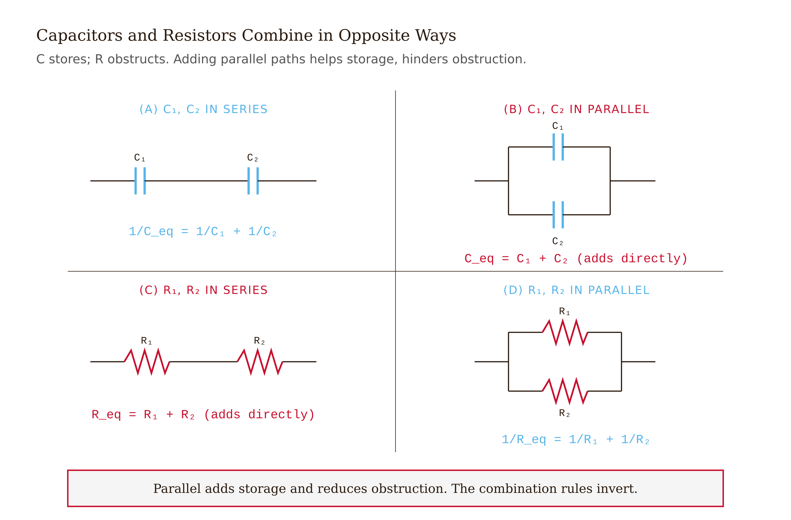
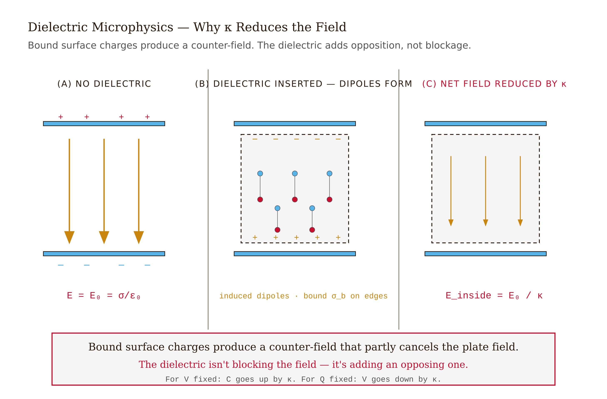
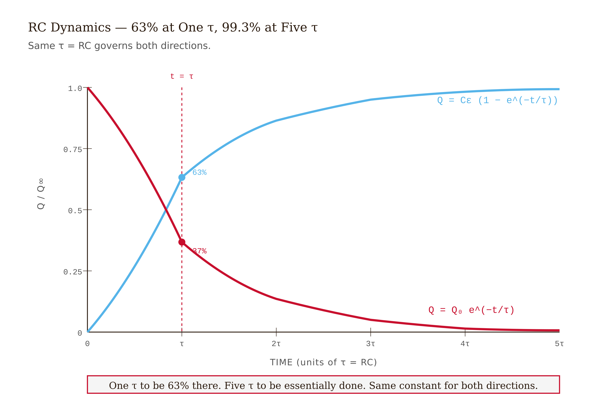
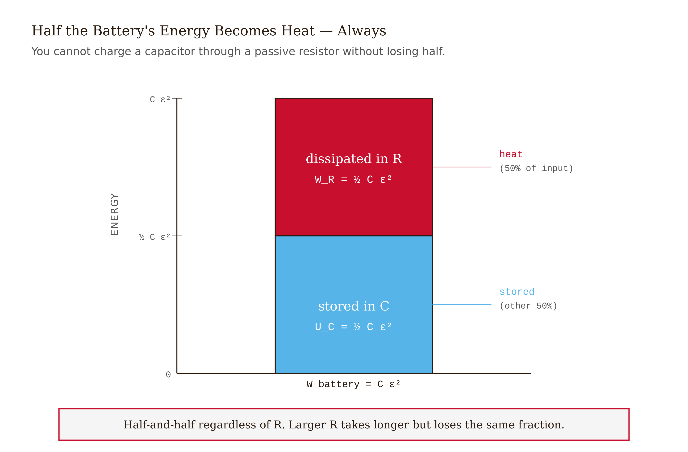

# Chapter 5 — Capacitance and Dielectrics

*The bridge from electrostatics to circuits, and the energy that lives in the field.*

---

A camera flash fires in about a millisecond. In that millisecond it delivers somewhere around 7 joules of light energy — which means it's drawing about 7000 watts during the discharge. The lithium battery in the camera can deliver perhaps a few watts continuously before it's exhausted. If the flash tried to run directly off the battery, the battery would die in seconds and the flash would be too dim to matter anyway.

The trick is a capacitor. The battery slowly charges a small electrolytic capacitor — typically around 150 microfarads — to about 300 volts. That takes a few seconds. When the photographer presses the shutter, a switch discharges the capacitor through the xenon flash tube in a millisecond. The battery accumulates energy slowly; the capacitor delivers it fast. The stored energy: $U = \frac{1}{2}CV^2 = \frac{1}{2}(150 \times 10^{-6})(300)^2 \approx 6.75$ J. The average discharge power: 6750 W.

This pattern — slow accumulation, fast controlled release — appears everywhere once you know to look for it. Defibrillators: 150 joules delivered in milliseconds to a patient's chest. Particle accelerator magnets: gigajoules stored in capacitor banks for pulsed experiments. The power supply in every smartphone: dozens of capacitors handling current spikes the battery cannot respond to quickly enough.

The physics behind all of it is the subject of this chapter.

---

## Capacitance

Two conductors carrying equal and opposite charges $+Q$ and $-Q$ develop a potential difference $V$ between them. The ratio of charge to potential difference is the **capacitance**:

$$C = \frac{Q}{V}$$

Units: farad (F) = coulomb/volt. A farad is an enormous unit; practical capacitors range from picofarads ($10^{-12}$ F) to thousands of farads in supercapacitors.

The important point is that $C$ is a purely geometric quantity. It depends on the shape and size of the conductors and on the material between them. It does not depend on $Q$ or $V$ individually. Double the charge on the plates: the voltage doubles, the ratio stays fixed. That fixed ratio, determined entirely by geometry, is what we call the capacitance.

This is not obvious in advance. There is no reason, without the physics, why doubling the charge should exactly double the voltage. The reason it does is that the electric field between the conductors is linear in $Q$ — which follows from superposition — and the potential is linear in the field. Linearity all the way down.

---

## Three canonical geometries

The recipe for finding capacitance is always the same three steps: compute $\vec{E}$ between the conductors (using Gauss's law from Chapter 3); integrate $-\vec{E} \cdot d\vec{\ell}$ to get $V$; divide $Q$ by $V$. Gauss's law does the heavy lifting every time.

**Parallel plates.** Area $A$, separation $d$, with $d \ll \sqrt{A}$ so we can ignore fringe fields at the edges. The surface charge density on each plate is $\sigma = Q/A$. Gauss's law gives $E = \sigma/\varepsilon_0 = Q/(\varepsilon_0 A)$ between the plates. The potential difference is $V = Ed = Qd/(\varepsilon_0 A)$:

$$C_{\text{plates}} = \frac{\varepsilon_0 A}{d}$$

More area, more capacitance. Smaller gap, more capacitance. Both make intuitive sense: you are packing more charge for a given voltage by increasing the plate area, and you are pushing the opposing charges closer together, which reduces the voltage needed to hold a given charge.

**Coaxial cylinders.** Inner conductor radius $a$, outer conductor inner radius $b > a$, length $L$. The field between them is cylindrically symmetric: $E(r) = \lambda/(2\pi\varepsilon_0 r) = Q/(2\pi\varepsilon_0 L r)$. Integrating from $a$ to $b$:

$$V = \frac{Q}{2\pi\varepsilon_0 L} \ln(b/a)$$

$$C_{\text{coax}} = \frac{2\pi\varepsilon_0 L}{\ln(b/a)}$$

This is the geometry of a coaxial cable. The field is confined between the inner and outer conductors; outside, the equal and opposite charges produce canceling fields. Coaxial cables work the way they do — carrying signals with minimal radiation — because the cylindrical symmetry traps the field inside.

**Concentric spheres.** Inner radius $a$, outer inner radius $b$. Field between them is radial: $E(r) = kQ/r^2$. Integrating:

$$V = kQ\left(\frac{1}{a} - \frac{1}{b}\right) = \frac{kQ(b-a)}{ab}$$

$$C_{\text{spherical}} = \frac{4\pi\varepsilon_0 ab}{b - a}$$

In the limit $b \to \infty$: an isolated sphere of radius $a$ has capacitance $C = 4\pi\varepsilon_0 a$. The Earth, radius $6.4 \times 10^6$ m, has capacitance about 710 µF. Large, but not enormous.

<!-- → [TABLE: three canonical capacitor geometries — columns: geometry, diagram description, C formula, real-world example] -->

---

## Energy stored, and where it lives

Build up the charge on a capacitor gradually. When the capacitor already holds charge $q$, the voltage across it is $q/C$. To move the next small increment $dq$ from the negative plate to the positive plate, you must do work $dW = (q/C)\,dq$ against that voltage. The total work to charge from zero to $Q$:

$$U = \int_0^Q \frac{q}{C}\,dq = \frac{Q^2}{2C} = \frac{1}{2}CV^2$$

Three equivalent forms of the same stored energy.

Now ask: *where is this energy?* The plates are conductors with surface charges. The energy must live somewhere — and the answer is in the field between the plates.

Rewrite the energy for a parallel-plate capacitor using $C = \varepsilon_0 A/d$ and $V = Ed$:

$$U = \frac{1}{2}\left(\frac{\varepsilon_0 A}{d}\right)(Ed)^2 = \frac{1}{2}\varepsilon_0 E^2 \cdot (Ad)$$

The quantity $Ad$ is the volume between the plates. So the energy per unit volume is:

$$u_E = \frac{1}{2}\varepsilon_0 E^2$$

This is the **energy density of the electric field**. It doesn't just apply to the space between capacitor plates — it is a universal statement. Wherever there is an electric field, there is energy, at a density of $\frac{1}{2}\varepsilon_0 E^2$. The field carries the energy; the conductors merely set up the field.

This is Maxwell's insight, and it matters far beyond this chapter. When we get to electromagnetic waves in Chapter 11, a propagating wave carries energy through empty space. There are no plates, no charges, nothing material. The energy is in the oscillating fields themselves, quantified by exactly this expression. The energy in sunlight crossing a square meter of ground, the energy transmitted by a radio antenna — all of it is accounted for by $\frac{1}{2}\varepsilon_0 E^2$ and its magnetic counterpart $\frac{1}{2\mu_0} B^2$.

*Figure 5.1 — Three Canonical Capacitor Geometries*

<!-- → [IMAGE: parallel-plate capacitor cross-section with uniform E field between plates, shaded to indicate energy density u_E = ½ε₀E² — annotations showing that the energy is distributed throughout the field volume, not concentrated on the plates] -->

---

## Combinations

Two capacitors in **parallel** share the same voltage $V$. Their charges add: $Q_{\text{total}} = C_1 V + C_2 V = (C_1 + C_2)V$. So:

$$C_{\text{eq, parallel}} = C_1 + C_2 + \cdots$$

Parallel capacitances add directly.

Two capacitors in **series** share the same charge $Q$ (whatever charge flows onto one plate of $C_1$ must flow off the adjacent plate, forcing the same $Q$ onto $C_2$). Their voltages add: $V = Q/C_1 + Q/C_2 = Q(1/C_1 + 1/C_2)$. So:

$$\frac{1}{C_{\text{eq, series}}} = \frac{1}{C_1} + \frac{1}{C_2} + \cdots$$

Series capacitances add reciprocally.

This is the opposite of resistors: series resistors add directly, parallel resistors add reciprocally. The inversion is real and has a clean physical reason. Capacitance measures *ease of storing charge* — it is a kind of storage capacity. Putting two storage containers in parallel directly adds capacity. Putting them in series divides the applied voltage between them, so each stores less charge for a given total voltage; the combined system has less capacitance than either alone. Resistance, by contrast, measures obstruction; parallel paths share the obstruction and reduce it, while series paths stack it.

*Figure 5.2 — Energy Density Lives in the Field Between the Plates*

<!-- → [IMAGE: side-by-side circuit diagrams — left: two capacitors C₁ and C₂ in parallel, both connected across the same voltage V, with charge labels Q₁=C₁V and Q₂=C₂V and the equivalent single capacitor C₁+C₂; right: two capacitors in series, same charge Q on each, voltage labels V₁=Q/C₁ and V₂=Q/C₂ adding to total V, equivalent single capacitor 1/(1/C₁+1/C₂)] -->

---

## Dielectrics

Fill the gap between capacitor plates with an insulating material — a **dielectric**. Two things happen at the atomic scale.

In every atom, the external field pushes the electron cloud one way and the nucleus the other, creating a tiny induced electric dipole. In molecules that have permanent dipoles (water is the most important example), the external field exerts a torque that partially aligns the dipoles against the randomizing effect of thermal motion. Both mechanisms produce the same result at the macroscopic level: a layer of bound positive charge on the face of the dielectric nearest the negative plate, and a layer of bound negative charge on the face nearest the positive plate.

These bound charges produce their own electric field — pointing *opposite* to the external field. The total field inside the dielectric is reduced:

$$E_{\text{inside}} = \frac{E_0}{\kappa}$$

where $\kappa$ is the **dielectric constant** (also called relative permittivity). For vacuum, $\kappa = 1$ by definition. Air: $\kappa \approx 1.0006$. Paper: $\kappa \approx 3.7$. Glass: $\kappa \approx 5$–10. Water: $\kappa \approx 80$. Strontium titanate, used in ceramic capacitors: $\kappa \approx 310$.

With a dielectric filling the gap and the charge $Q$ fixed, the field drops by $\kappa$, so the voltage $V = Ed$ drops by $\kappa$. Since $C = Q/V$:

$$C_{\text{die}} = \kappa C_0$$

The dielectric multiplies the capacitance by $\kappa$. Practical consequence: modern ceramic capacitors with $\kappa$ in the thousands store microfarads in millimeter-scale packages. High-$\kappa$ dielectrics are why your phone's circuit board doesn't require a capacitor the size of a dinner plate.

*Figure 5.3 — Series vs Parallel*

<!-- → [IMAGE: parallel-plate capacitor with dielectric — left side shows free charges on plates (+Q, -Q), right side shows bound charges on dielectric faces (opposing sign) — arrows showing E₀ (external) and E_bound (opposing), net E = E₀/κ in the middle] -->

The effect depends critically on whether the battery is connected when you insert the dielectric.

**Battery connected (fixed voltage $V$):** inserting the dielectric reduces $E$ inside, which would lower $V$ — but the battery responds by pumping in more charge to maintain $V$. Result: $Q$ increases by $\kappa$, $C$ increases by $\kappa$, stored energy $U = \frac{1}{2}CV^2$ increases by $\kappa$. The battery does work; the capacitor stores more.

**Battery disconnected (fixed charge $Q$):** the charge cannot change. Inserting the dielectric reduces $E$ and $V$ by $\kappa$. The stored energy $U = Q^2/2C$ drops by $\kappa$. Where did the energy go? Into the mechanical work done by the electric field *pulling the dielectric slab into the gap*. The slab is attracted into the region of strong field — it lowers the system's energy by entering, so the field does work on it. If you pulled the slab back out, you'd recover that energy.

These two scenarios — fixed $V$ versus fixed $Q$ — produce opposite behavior for the stored energy, and getting them confused is one of the cleanest ways to lose points on an exam.

<!-- → [TABLE: dielectric insertion — rows: fixed V (battery connected) vs. fixed Q (battery disconnected); columns: Q, V, E, C, U — what increases, decreases, or stays fixed] -->

---

## RC dynamics

Connect a capacitor $C$ through a resistor $R$ to a battery of EMF $\varepsilon$. Kirchhoff's voltage law around the loop:

$$\varepsilon = IR + \frac{Q}{C}$$

With $I = dQ/dt$, this becomes a first-order linear differential equation:

$$\frac{dQ}{dt} = \frac{\varepsilon}{R} - \frac{Q}{RC}$$

With $Q(0) = 0$, the solution is:

$$Q(t) = C\varepsilon\left(1 - e^{-t/RC}\right)$$

The current decays as:

$$I(t) = \frac{\varepsilon}{R}\,e^{-t/RC}$$

The characteristic time is $\tau = RC$. After one $\tau$, the capacitor has reached about 63% of full charge. After five $\tau$, it is at 99.3%.

When the battery is disconnected and the capacitor discharges through $R$, the equation reverses: $Q(t) = Q_0 e^{-t/RC}$. The same time constant governs both processes.

Now an energy puzzle. The battery delivers total energy $W_{\text{battery}} = \varepsilon \cdot Q_{\text{final}} = C\varepsilon^2$ during the charging process. The capacitor stores $U_C = \frac{1}{2}C\varepsilon^2$. That accounts for exactly half the battery's energy. The other half — also exactly $\frac{1}{2}C\varepsilon^2$ — is dissipated as heat in the resistor.

The disturbing part is that this split is independent of $R$. A small resistor charges the capacitor quickly and wastes half the energy in a short, hot burst. A large resistor charges slowly and wastes half the energy in a long, gentle trickle. The total heat dissipated is always exactly half, regardless. You cannot charge a capacitor through any passive resistor without losing half the battery's energy to heat.

To verify this: $W_R = \int_0^\infty I^2 R\,dt = \int_0^\infty (\varepsilon/R)^2 e^{-2t/RC} R\,dt = (\varepsilon^2/R) \cdot (RC/2) = \frac{1}{2}C\varepsilon^2$. The $R$ cancels, as promised.

The only escape: charge through an inductor instead of a resistor. The inductor-capacitor combination oscillates, and in the ideal (lossless) case no energy is dissipated. But real inductors have resistance, and real systems add damping. The chapter doesn't develop this further; it returns in Chapter 8.

*Figure 5.4 — Dielectric Microphysics*

<!-- → [CHART: Q(t) and I(t) for RC charging — Q curve rising from 0 toward Cε with asymptote, I curve decaying from ε/R toward 0, vertical reference line at t = τ = RC labeled "63% charged"] -->

*Figure 5.5 — RC Charging and Discharging*

<!-- → [INFOGRAPHIC: energy accounting for RC charging — battery supplies Cε², pie chart or bar chart showing exactly half (½Cε²) going to capacitor storage and exactly half (½Cε²) dissipated in resistor as heat — label "independent of R"] -->

---

## Worked example: inserting a dielectric with the battery disconnected

Parallel-plate capacitor: $A = 1.0$ cm², $d = 0.1$ mm, in air. Connect to a 12 V battery, let it charge fully, then disconnect the battery. Now slide a mica sheet ($\kappa = 7$) into the gap.

**Before inserting mica (battery connected, then disconnected):**
$$C_0 = \frac{\varepsilon_0 A}{d} = \frac{(8.85 \times 10^{-12})(10^{-4})}{10^{-4}} = 8.85 \text{ pF}$$
$$Q = C_0 V = (8.85 \times 10^{-12})(12) \approx 0.11 \text{ nC}$$
$$E_0 = V/d = 12 / (10^{-4}) = 1.2 \times 10^5 \text{ V/m}$$
$$U_0 = \tfrac{1}{2}C_0 V^2 = \tfrac{1}{2}(8.85 \times 10^{-12})(144) \approx 6.4 \times 10^{-10} \text{ J}$$

**After inserting mica (charge fixed at 0.11 nC):**
$$C = \kappa C_0 = 7 \times 8.85 \text{ pF} = 62 \text{ pF}$$
$$V = Q/C = 0.11 \times 10^{-9} / (62 \times 10^{-12}) \approx 1.7 \text{ V}$$
$$E = V/d = 1.7 / (10^{-4}) = 1.7 \times 10^4 \text{ V/m} \quad (= E_0/\kappa)$$
$$U = Q^2/(2C) \approx 9 \times 10^{-11} \text{ J} \quad (= U_0/\kappa)$$

Everything that could drop did drop by a factor of $\kappa = 7$. The charge stayed fixed because there was nowhere for it to go. The energy that disappeared went into the work done by the field as it pulled the dielectric slab into the gap — the slab is attracted into the strong-field region, and the system releases energy as it does so.

**The lesson.** With the battery disconnected, inserting a dielectric reduces $V$, $E$, and $U$ each by $\kappa$. With the battery connected, the opposite happens to $U$ — it increases by $\kappa$, because the battery pumps in additional charge to keep $V$ fixed.

---

## Common misconceptions

**"A capacitor stores charge."** The net charge on a capacitor is zero. It holds $+Q$ on one plate and $-Q$ on the other. What a capacitor stores is energy — in the electric field between the plates.

**"The energy is on the plates."** Energy density is $\frac{1}{2}\varepsilon_0 E^2$, distributed throughout the volume where the field exists. Plates with no field between them store nothing.

**"Series capacitors add directly."** Parallel capacitors add directly. Series capacitors add *reciprocally* — opposite to resistors.

**"You can reduce charging losses by using a smaller resistor."** No. Exactly half of the battery's energy is dissipated as heat during charging, regardless of $R$. The R cancels in the calculation.

---

## Exercises

**Warm-up 1.** *(Capacitance definition — tests: $C = Q/V$ as geometric property)* A parallel-plate capacitor has plates of area $A = 200$ cm² separated by $d = 2$ mm. (a) Compute $C$ in vacuum. (b) If connected to a 9 V battery, what charge accumulates on each plate? (c) If the gap is doubled to 4 mm, what happens to $C$, $Q$, and $V$ — assuming the battery remains connected?

**Warm-up 2.** *(Energy stored)* A 470 µF capacitor is charged to 16 V. (a) How much energy is stored? Express in joules and in millijoules. (b) If the capacitor discharges in 2 ms, what is the average power delivered during discharge? (c) How does this compare to the power that would be available if the same energy were delivered over 1 second?

**Warm-up 3.** *(RC time constant)* An RC circuit has $R = 22$ kΩ and $C = 100$ µF charged from a 5 V battery. (a) What is $\tau$? (b) At $t = \tau$, what is the charge on the capacitor? (c) At $t = 3\tau$, what fraction of the final charge is still uncharged? (d) After how many time constants is the capacitor at 99% of full charge?

**Application 1.** *(Series and parallel)* Three capacitors: $C_1 = 4$ µF, $C_2 = 6$ µF, $C_3 = 12$ µF. Find $C_{\text{eq}}$ when all three are (a) in parallel, (b) in series. For (b), also find the voltage across each capacitor when the combination is connected to a 24 V battery. Verify that the three voltages sum to 24 V.

**Application 2.** *(Dielectric — fixed voltage)* A parallel-plate capacitor with $A = 50$ cm², $d = 1$ mm is connected to a 100 V battery and allowed to reach equilibrium. A dielectric slab with $\kappa = 5$ is then inserted while the battery remains connected. Find $C$, $Q$, $E$, and $U$ before and after insertion. In which quantities did the factor of $\kappa$ appear as an increase, and in which did it not change?

**Application 3.** *(Coaxial capacitance)* A coaxial cable has inner conductor radius $a = 0.5$ mm and outer conductor inner radius $b = 3.5$ mm, length $L = 1$ m. (a) Find $C$. (b) If the space between conductors is filled with polyethylene ($\kappa = 2.3$), find the new $C$. (c) The cable is charged to 50 V. Find the electric field at $r = a$ and at $r = b$. At which radius is the field strongest, and why does this matter for the breakdown voltage of the cable?

**Synthesis 1.** *(Energy in the field)* A parallel-plate capacitor has $A = 100$ cm², $d = 1$ mm, charged to $V = 500$ V. (a) Find $E$ between the plates. (b) Compute the total stored energy two ways: via $U = \frac{1}{2}CV^2$ and via $U = u_E \times \text{volume} = \frac{1}{2}\varepsilon_0 E^2 \times Ad$. Verify they agree. (c) The plates are pulled apart to $d = 2$ mm while disconnected from any battery. Find the new $V$, $E$, and $U$. Where did the extra energy come from?

**Synthesis 2.** *(The half-energy result)* A 200 µF capacitor is charged from a 12 V battery through a 1 kΩ resistor, then through a 10 Ω resistor. (a) Find the final stored energy in both cases. (b) Find the total heat dissipated in the resistor in both cases. (c) Find the total energy delivered by the battery in both cases. Comment on what is and is not independent of $R$.

**Challenge.** *(Mixed dielectric)* A parallel-plate capacitor has plate area $A$ and total gap $d$. The gap is filled with two dielectric slabs in series: slab 1 has thickness $d_1$ and dielectric constant $\kappa_1$; slab 2 has thickness $d_2 = d - d_1$ and dielectric constant $\kappa_2$. Derive an expression for $C$ in terms of $\varepsilon_0$, $A$, $d_1$, $d_2$, $\kappa_1$, $\kappa_2$. Show that in the limit $\kappa_1 = \kappa_2 = \kappa$ your result reduces to $C = \kappa\varepsilon_0 A/d$. (Hint: treat the two slabs as two capacitors in series.)

---

## LLM Exercises

### Build the RC charge/discharge simulator (`05-capacitor-rc.html`)

> **Show.** RC charging: $Q(t) = C\varepsilon(1 - e^{-t/RC})$. RC discharging: $Q(t) = Q_0 e^{-t/RC}$. Time constant $\tau = RC$.
>
> **Say.** Build an interactive RC-circuit charging/discharging visualizer with parallel dielectric demonstration.
>
> **Constrain.** D3 v7. Panel 1: schematic circuit with battery $\varepsilon$, resistor $R$, capacitor $C$. Sliders for $R$ (1 Ω to 1 kΩ), $C$ (1 µF to 1000 µF), $\varepsilon$ (1 V to 20 V). Toggle: charge / discharge mode. Live plots of $Q(t)$, $V_C(t)$, $I(t)$, and $U(t)$ updating in real time. Show $\tau = RC$ as a vertical reference line on the time axis. Animate orange dots flowing along wires to represent current; speed proportional to $|I|$. Panel 2: parallel-plate capacitor with dielectric slider $\kappa \in [1, 100]$. Show: $E$ between plates (color-mapped), $C$ readout, $U$ readout. Filename: `05-capacitor-rc.html`.
>
> **Verify.** (a) Charging from zero: $Q$ rises toward $C\varepsilon$, reaching $\approx 63\%$ at $t = \tau$. (b) Doubling $R$ doubles $\tau$ (curves stretch out by factor 2). (c) Inserting dielectric (Panel 2) with battery disconnected: $E$ drops by $\kappa$, $V$ drops by $\kappa$. (d) The energy dissipated in the resistor during charging equals the energy stored in the capacitor at the end.

### Exploration

- Charge a 100 µF capacitor through a 100 Ω resistor with $\varepsilon = 10$ V. Measure $\tau$ from the curve. (Should be 10 ms.)
- Reduce $R$ by a factor of 10. Does charging speed up by a factor of 10? Does the *energy lost in the resistor* change?
- In the dielectric panel: insert a $\kappa = 80$ dielectric (water-like). What happens to the stored energy if the battery is connected? Disconnected?

### Extension prompt (chapter bridge)

> **Show.** I've seen capacitors store and discharge energy through resistors. Now I want to see what happens when the charge flows — what current and voltage do in more complex circuits.
>
> **Say.** Build a DC circuit analyzer: drag-and-drop resistors and batteries onto a grid, automatically solve for branch currents and node voltages.
>
> **Constrain.** Use nodal analysis (Kirchhoff's laws). Display branch currents as animated orange arrows. Display node voltages as labels. Show power dissipated in each resistor.
>
> **Verify.** A simple series circuit: current is the same through every resistor. A simple parallel circuit: voltage is the same across each.

Save as `05b-dc-circuits-preview.html`. This is the lead-in to Chapter 7.

---

## What would change my mind

The energy density $u_E = \frac{1}{2}\varepsilon_0 E^2$ is not an isolated result — it propagates into the electromagnetic wave equations in Chapter 11, where it predicts the power carried by light and radio waves. A century of antenna engineering and radiometry has found no systematic error. If the expression were wrong, every calculation of radiated power, every calibrated detector, every solar cell efficiency calculation would be off. They aren't. The dielectric constant's microscopic underpinning — the Clausius-Mossotti relation connecting $\kappa$ to molecular polarizability — is well-established. At very high frequencies, $\kappa$ becomes frequency-dependent and complex (the imaginary part describes absorption); the chapter treats $\kappa$ as real and constant, which is valid for DC and low-frequency AC.

## Still puzzling

*The half-energy-lost result.* You cannot charge a capacitor through a resistor without losing half the battery's energy to heat, independent of $R$. The only physical escape: an inductor instead of a resistor, which trades the dissipation for LC oscillation. Switching power converters approximate this in practice, achieving efficiencies above 95% by cycling an inductor rapidly. The chapter introduces the puzzle; Chapter 8 provides the LC mechanism.

*Supercapacitor energy density.* As of 2026, supercapacitors store 10–20 Wh/kg — an order of magnitude below lithium-ion batteries but with far higher power density and essentially unlimited cycle life. The frontier is in double-layer capacitance at electrode surfaces and in high-$\kappa$ materials research. The energy-vs-power tradeoff is not a fixed wall; it is being pushed.

*Why water has $\kappa \approx 80$.* The anomalously high dielectric constant of water — compared to 3–10 for most insulators — is a consequence of the molecule's large permanent dipole moment and its ability to form cooperative hydrogen-bonded networks that amplify alignment. In bulk water, neighboring dipoles reinforce each other's alignment. At high frequency (above about 10 GHz), the molecules can't rotate fast enough to follow the field and $\kappa$ drops toward optical values around 1.8. The transition is the operating principle of a microwave oven.

---

**Tags:** capacitance, dielectric, energy density, RC circuit, time constant, supercapacitor, polarization, coaxial cable

*Figure 5.6 — Half-Energy-Lost*

