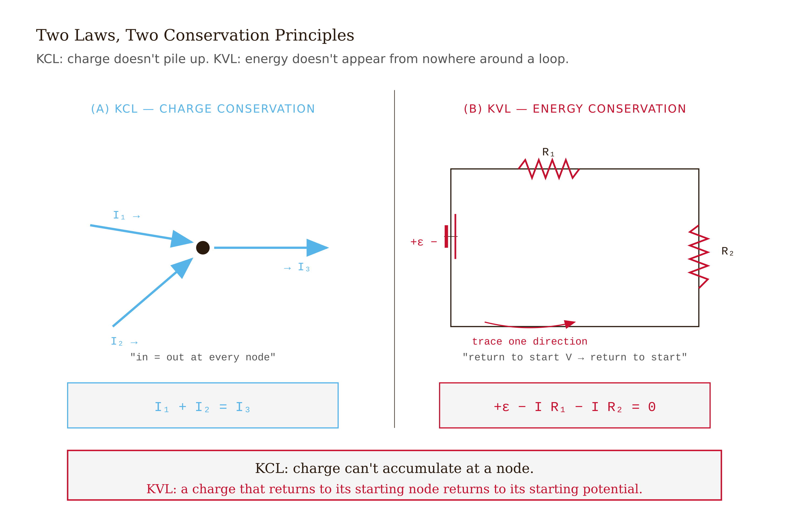
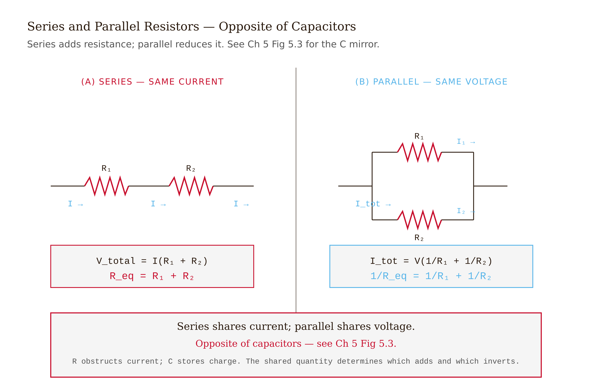
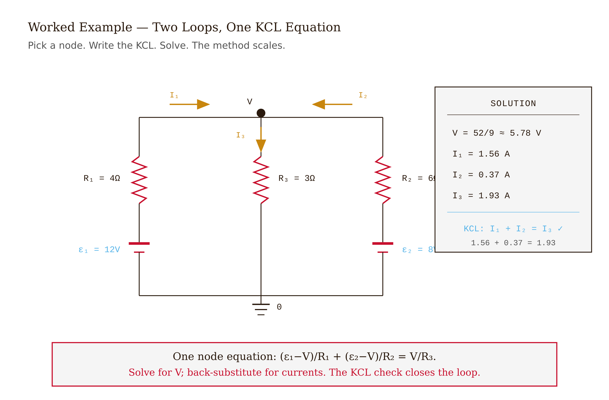
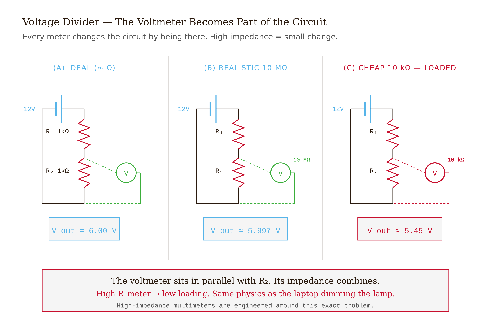
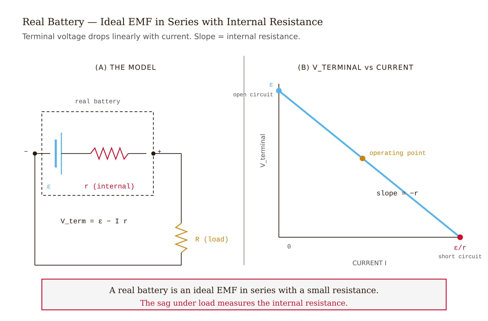

# Chapter 7 — DC Circuits

*Kirchhoff's two laws and the systematic analysis of any DC circuit.*

---

A student has three lamps plugged into a power strip. One day the third lamp stops working — but only when her laptop charger is plugged into the same strip. Unplug the laptop, the lamp works. Plug it back in, the lamp goes dark. The bulb is new. Nothing is broken.

Here is what is actually happening. The power strip's wiring has a small resistance — call it 0.5 Ω. The laptop charger draws roughly 8 A on startup. Eight amperes through half an ohm drops 4 volts. The lamp that was getting 120 V is now getting 116 V. For two of the lamps that doesn't matter; they light at any reasonable voltage. But the third lamp has an aging filament that requires at least 119 V to strike. At 116 V it simply doesn't light.

The lamp is not broken. The laptop charger is not broken. The power strip is not broken. What's happening is that the circuit connecting them has finite resistance, the laptop is drawing current through that resistance, and the resulting voltage drop is enough to drop one lamp below its threshold. The lamp stopped working because of the circuit it's embedded in — not because of anything wrong with the lamp itself.

This is called the **loading effect**, and it is real and important. You cannot understand it without being able to analyze a multi-element circuit — to find the actual current at each branch and the actual voltage at each node, accounting for every resistance in the system. The two laws that let you do this are Kirchhoff's current law and Kirchhoff's voltage law. They are the subject of this chapter.

---

## The two laws

**Kirchhoff's Current Law (KCL).** At any junction where wires meet — any node — the total current flowing in equals the total current flowing out:

$$\sum I_{\text{in}} = \sum I_{\text{out}}$$

This is conservation of charge. Charge cannot accumulate at a node; if it did, the potential at that node would rise without limit and the current would immediately change to redistribute it. In any steady state, current is conserved at every node.

**Kirchhoff's Voltage Law (KVL).** The sum of all voltage changes around any closed loop is zero:

$$\sum_{\text{loop}} \Delta V = 0$$

Walking around a loop, you pass through batteries (which raise the voltage from − to +) and through resistors (which drop the voltage in the direction of current flow). When you get back to where you started, the net change must be zero — because "voltage" is just potential energy per charge, and potential energy is a function of position. If you return to the same point, you return to the same potential.

This is conservation of energy. A charge carried around any closed loop returns to its starting energy. The net work done on it is zero.

These two laws plus Ohm's law ($V = IR$) are sufficient to solve any DC circuit. Everything else in this chapter is technique.

*Figure 7.1 — Kirchhoff's Two Laws*

<!-- → [IMAGE: node diagram illustrating KCL — three currents arriving at a junction (labeled I₁, I₂, I₃) and two currents leaving (labeled I₄, I₅), with the equation I₁+I₂+I₃ = I₄+I₅ written beneath] -->

---

## Resistors in series and parallel

Two resistors $R_1$ and $R_2$ in **series** carry the same current $I$. The total voltage drop across both is $IR_1 + IR_2 = I(R_1 + R_2)$. The pair behaves as a single resistor:

$$R_{\text{series}} = R_1 + R_2 + \cdots$$

Two resistors in **parallel** share the same voltage $V$ across them. The total current is $V/R_1 + V/R_2 = V(1/R_1 + 1/R_2)$. The pair behaves as:

$$\frac{1}{R_{\text{parallel}}} = \frac{1}{R_1} + \frac{1}{R_2} + \cdots$$

For two resistors in parallel the formula collapses to $R_{\text{eq}} = R_1 R_2/(R_1 + R_2)$. Two equal resistors $R$ in parallel give $R/2$.

The direction of these rules is opposite to capacitors. Capacitors add in parallel; resistors add in series. Capacitors add reciprocally in series; resistors add reciprocally in parallel. This inversion has a physical reason in each case — but the directions are easy to confuse, and getting them backwards is one of the most common errors in a circuits course.

<!-- → [TABLE: series vs. parallel rules for resistors and capacitors — four cells, resistors in series, resistors in parallel, capacitors in series, capacitors in parallel — with the formula and the physical reason in each cell] -->

A useful derived result is the **voltage divider**: two resistors $R_1$ and $R_2$ in series across a supply $V_{\text{in}}$, with the output measured across $R_2$:

$$V_{\text{out}} = V_{\text{in}} \cdot \frac{R_2}{R_1 + R_2}$$

The output is a fixed fraction of the input, set by the ratio of resistances. This circuit appears everywhere — setting reference voltages, biasing transistors, building adjustable attenuators. Its dual is the **current divider**: two resistors in parallel sharing a total current $I$, where the larger resistor gets the smaller current (opposite of the voltage divider's intuition, and worth keeping straight).

*Figure 7.2 — Series and Parallel Resistors*

<!-- → [IMAGE: voltage divider schematic — R₁ and R₂ in series across V_in, output V_out tapped across R₂, formula V_out = V_in × R₂/(R₁+R₂) labeled — annotate that the output voltage is a fixed fraction of the input set by the resistance ratio, not the absolute values] -->

---

## Real batteries

An ideal battery delivers constant voltage $\varepsilon$ regardless of what current you draw. Real batteries don't. The standard model of a real battery is an ideal EMF $\varepsilon$ in series with a small **internal resistance** $r$. The terminal voltage — what you actually measure across the battery's terminals under load — is:

$$V_{\text{terminal}} = \varepsilon - Ir$$

At zero current (open circuit), $V_{\text{terminal}} = \varepsilon$. Under load, it drops by $Ir$.

A car battery has $r \sim 0.01$ Ω. The starter motor draws 200 A. Terminal voltage drops by $200 \times 0.01 = 2$ V — from 12.6 V to about 10.6 V. That's why the dashboard lights dim when you crank the engine. A fresh AA battery has $r \sim 0.15$ Ω; a heavily depleted one might have $r \sim 3$ Ω, which is why old batteries can't drive high-current loads even though they still measure 1.4 V on an open-circuit test.

The maximum current any battery can deliver is $I_{\max} = \varepsilon/r$, the short-circuit current. For a car battery: roughly 1200 A. The internal resistance is the limiting factor.

The laptop-charger problem from the opening is exactly this physics, with the power strip's wiring playing the role of internal resistance. The "battery" is the outlet at 120 V; the "internal resistance" is the wiring; the laptop charger is a high-current load dragging down the terminal voltage seen at the lamp.

*Figure 7.3 — Two-Loop Circuit*

<!-- → [IMAGE: circuit diagram of real battery model — ideal EMF ε in series with internal resistance r, terminal voltage V_terminal labeled, load resistance R_ext shown, with annotation showing V_terminal = ε - Ir] -->

---

## The nodal method

For any circuit with $N$ nodes, you can find all voltages and currents by solving $N-1$ equations. The method:

1. Label every node with a variable $V_0, V_1, V_2, \ldots$, and set one node (usually ground) to zero: $V_0 = 0$.
2. Write KCL at each non-ground node: the sum of all currents flowing out of the node equals zero.
3. Express each branch current using Ohm's law: $I_{\text{branch}} = (V_A - V_B)/R$ where $A$ and $B$ are the nodes at the branch's two ends.
4. Solve the system of linear equations.

For a two-node circuit, this gives one equation in one unknown. For a circuit with many nodes it gives a system that can be solved by any standard method — substitution, matrix elimination, or a computer.

The key advantage of nodal analysis over other methods (loop analysis, mesh analysis) is that the setup is automatic. No choices to make about which loops to pick. Just label the nodes, write KCL at each one, and solve.

---

## Worked example: two batteries, three resistors

Battery 1 ($\varepsilon_1 = 12$ V, ideal) connected through $R_1 = 4\,\Omega$ to a central node. Battery 2 ($\varepsilon_2 = 8$ V, ideal) connected through $R_2 = 6\,\Omega$ to the same central node. That central node connects through $R_3 = 3\,\Omega$ to ground. Find the current through each resistor.

**Setup.** Two nodes: ground ($V = 0$) and the central node (call its potential $V$).

**Branch currents in terms of $V$:**

The positive terminal of battery 1 is at potential $\varepsilon_1 = 12$ V (it fixes the voltage at its positive terminal above ground). Current flows from that terminal through $R_1$ into the node:
$$I_1 = \frac{12 - V}{4}$$

Similarly for battery 2:
$$I_2 = \frac{8 - V}{6}$$

Current flows out of the node through $R_3$ to ground:
$$I_3 = \frac{V}{3}$$

**KCL at the central node** (currents in = currents out):
$$\frac{12 - V}{4} + \frac{8 - V}{6} = \frac{V}{3}$$

Multiply through by 12:
$$3(12 - V) + 2(8 - V) = 4V$$
$$36 - 3V + 16 - 2V = 4V$$
$$52 = 9V$$
$$V = \frac{52}{9} \approx 5.78\text{ V}$$

**Back out the branch currents:**
$$I_1 = \frac{12 - 5.78}{4} = 1.56\text{ A}, \qquad I_2 = \frac{8 - 5.78}{6} = 0.37\text{ A}, \qquad I_3 = \frac{5.78}{3} = 1.93\text{ A}$$

**Check KCL:** $I_1 + I_2 = 1.56 + 0.37 = 1.93 = I_3$. ✓

**Check KVL** (left loop, going from ground up through battery 1 then through $R_1$ back to the node):
$12 - I_1 \cdot 4 = 12 - 6.24 = 5.76 \approx V$. ✓ (small rounding error from keeping two decimal places.)

**What this reveals.** Battery 2 is weaker — 8 V against battery 1's 12 V. The central node settles at 5.78 V, which is between the two source voltages but pulled toward the weaker one because the stronger battery is also driving more current. If battery 2 were even weaker — say 4 V — its current would reverse direction: it would be *charged by* battery 1 rather than contributing. The sign of $I_2$ tells you automatically. This is how you analyze battery charging circuits.

**The limit.** This works for DC circuits with resistors and ideal voltage sources. Add capacitors or inductors and the currents become time-varying; the equations become differential. Add diodes or transistors and the equations become nonlinear. Both are doable — industrial simulators like SPICE handle them routinely — but the foundation is always KCL and KVL.

*Figure 7.4 — Voltage Divider Loading*

<!-- → [IMAGE: circuit diagram for the two-battery worked example — battery 1 (12V) and R₁ (4Ω) on the left, battery 2 (8V) and R₂ (6Ω) on the right, both meeting at the central node V, with R₃ (3Ω) going from the node to ground — branch currents I₁, I₂, I₃ labeled with directions] -->

---

## Measuring things: voltmeters and ammeters

A voltmeter measures the potential difference between two nodes. Ideally, it draws no current — it has infinite resistance and doesn't disturb the circuit. A real voltmeter has a large but finite resistance, typically 1–10 MΩ for a digital multimeter.

An ammeter measures the current through a branch. Ideally, it has zero resistance — you insert it in series and it doesn't change the circuit. A real ammeter has a small but nonzero resistance, typically milliohms.

The **loading effect** applies to meters: any meter changes the circuit by being in it. A voltmeter in parallel with a 100 Ω resistor is negligible if the meter has 10 MΩ resistance — the parallel combination is $100 \times 10^7 / (100 + 10^7) \approx 100$ Ω, essentially unchanged. But the same voltmeter measuring a 50 MΩ source resistance is in trouble: the parallel combination is now $50 \times 10 / (50 + 10) = 8.3$ MΩ — not 50 MΩ. The meter is pulling down the reading.

A useful habit: before trusting a meter reading, check whether the meter's resistance is at least 100× the source impedance. Below that ratio, correct for the loading explicitly.

*Figure 7.5 — Real Battery*

<!-- → [IMAGE: loading-effect diagram — left: voltmeter (R_meter = 10MΩ) measuring across a 100Ω resistor, showing negligible effect; right: same voltmeter measuring across a 50MΩ resistor, showing the parallel combination drops to 8.3MΩ and the reading is wrong — the change in the equivalent resistance is labeled in both cases] -->

---

## Power dissipation

Power delivered to any circuit element is voltage times current:

$$P = IV = I^2 R = \frac{V^2}{R}$$

All three forms are equivalent via Ohm's law. Choose the one that matches what you know.

For a real battery driving a circuit: total power from the source is $P_{\text{total}} = \varepsilon I$. Of this, $P_{\text{internal}} = I^2 r$ is dissipated as heat inside the battery. The rest, $P_{\text{external}} = (\varepsilon - Ir)I = V_{\text{terminal}} \cdot I$, is delivered to the external circuit.

There is a theorem about maximizing that external power. Suppose you can choose the external load resistance $R_{\text{ext}}$. The power delivered to $R_{\text{ext}}$ is $P_{\text{ext}} = I^2 R_{\text{ext}} = \varepsilon^2 R_{\text{ext}} / (R_{\text{ext}} + r)^2$. Setting $dP_{\text{ext}}/dR_{\text{ext}} = 0$ gives $R_{\text{ext}} = r$: maximum power transfer occurs when the load resistance equals the source's internal resistance. At that match, the efficiency is only 50% — half the source power is wasted internally — but the *delivered* power is at its peak value of $\varepsilon^2/(4r)$.

This result is taken seriously in radio engineering, where the concern is maximizing signal power to an antenna or receiver, not efficiency. In power engineering (electrical grids, motors), the 50% efficiency at maximum transfer is unacceptable and loads are designed to have much higher resistance than the source impedance. Different problems, different criteria.

<!-- → [CHART: P_ext vs. R_ext for fixed ε and r — bell-shaped curve with peak at R_ext = r, labeled P_max = ε²/4r — annotations showing that below the peak R_ext < r (more current, lower voltage) and above R_ext > r (lower current, higher voltage), both reducing delivered power; a second curve showing efficiency rising monotonically from 50% at the peak toward 100% as R_ext → ∞] -->

---

## Where the energy actually flows

There is something strange about circuits that is almost never discussed in introductory courses, and I want to mention it.

In a simple circuit — a battery connected to a resistor by two wires — your intuition says the energy flows through the wires, from battery to resistor. The electrons push through the wire and carry energy with them.

This is wrong. The electrons in the wire move very slowly — at drift velocity, perhaps a millimeter per second. They carry almost no kinetic energy. The energy is transmitted not *through* the wires but *around* them, through the electromagnetic field surrounding the circuit. The Poynting vector $\vec{S} = \vec{E} \times \vec{H}$, which we will meet in Chapter 11, points from the battery toward the resistor through the empty space outside the circuit. The wires *guide* the electromagnetic field; they don't transport the energy inside themselves.

This is true and strange and well-established. It doesn't change how you calculate anything in this chapter — KCL, KVL, and Ohm's law give the right answers regardless of the mechanism. But it is worth knowing what is actually happening when a circuit "delivers power."

---

## Common misconceptions

**"Current gets used up by a resistor."** Current is conserved at every node — the same current that enters a resistor exits it. What gets dissipated is *energy*, at rate $I^2R$. The current is not consumed.

**"A battery always delivers its rated voltage."** Only at zero current. Under any finite load, the terminal voltage is $\varepsilon - Ir$. The rated voltage is the open-circuit value.

**"Adding resistors in parallel adds resistance."** It reduces it. More paths means less total obstruction. Two 10 Ω resistors in parallel give 5 Ω.

**"KVL only works for single-loop circuits."** It works for any closed loop in any circuit. In multi-loop circuits you need enough independent loops to determine all the currents — but KVL is valid everywhere.

---

## Exercises

**Warm-up 1.** *(Series and parallel — tests: direct application of combination rules)* Three resistors: 12 Ω, 18 Ω, 36 Ω. Find $R_{\text{eq}}$ for (a) all three in series, (b) all three in parallel, (c) the 12 Ω in series with the parallel combination of 18 Ω and 36 Ω. For case (c), if the combination is connected to a 24 V battery, find the current through each resistor.

**Warm-up 2.** *(KVL in a single loop — tests: voltage rises and drops around a loop)* A 9 V battery (ideal) drives a series circuit: $R_1 = 100\,\Omega$, $R_2 = 150\,\Omega$, $R_3 = 250\,\Omega$. (a) Find the current. (b) Find the voltage across each resistor. (c) Verify KVL: confirm the three voltage drops sum to 9 V. (d) Find the power dissipated in each resistor and verify it sums to the power delivered by the battery.

**Warm-up 3.** *(Internal resistance — tests: terminal voltage under load)* A battery has EMF $\varepsilon = 6$ V and internal resistance $r = 0.5\,\Omega$. (a) What is the open-circuit terminal voltage? (b) When connected to a 5.5 Ω load, what is the terminal voltage? What current flows? (c) At what load resistance does the terminal voltage fall to 5 V? (d) What is the short-circuit current?

**Application 1.** *(Nodal analysis — tests: KCL at a node, Ohm's law for branch currents)* Repeat the worked example from the chapter with different values: $\varepsilon_1 = 15$ V, $R_1 = 5\,\Omega$; $\varepsilon_2 = 9$ V, $R_2 = 3\,\Omega$; $R_3 = 6\,\Omega$. Find the central node voltage $V$ and all three branch currents. Check KCL and one KVL loop.

**Application 2.** *(Voltage divider with load — tests: loading effect on a divider)* A voltage divider has $R_1 = R_2 = 10\,\text{k}\Omega$ powered by $V_{\text{in}} = 10$ V. (a) Unloaded output voltage across $R_2$? (b) A $10\,\text{k}\Omega$ load resistor is connected across $R_2$. What is the new output voltage? What fraction of the ideal value is lost? (c) Repeat for a $100\,\text{k}\Omega$ load. At what load resistance does the output drop by more than 5% from ideal?

**Application 3.** *(Meter loading — tests: real measurement disturbs the circuit)* A circuit has two resistors in series: $R_1 = 1\,\text{M}\Omega$ and $R_2 = 1\,\text{M}\Omega$, connected to a 10 V battery. (a) Ideal voltage across $R_2$? (b) A digital multimeter with $10\,\text{M}\Omega$ internal resistance is placed across $R_2$. What does it read? (c) A cheaper meter with $1\,\text{M}\Omega$ internal resistance is used instead. What does it read? (d) What would a student conclude about the circuit if they trusted the cheap meter's reading?

**Synthesis 1.** *(Three-node circuit — tests: KCL at two nodes simultaneously)* Four resistors and a battery: $\varepsilon = 12$ V from ground to node A; $R_1 = 2\,\Omega$ from node A to node B; $R_2 = 4\,\Omega$ from node A to ground; $R_3 = 3\,\Omega$ from node B to ground; $R_4 = 6\,\Omega$ from node B to ground. Set up and solve the two-equation nodal system for $V_A$ and $V_B$. Find the current through each resistor and verify KCL at both nodes.

**Synthesis 2.** *(Power and efficiency — tests: power budget for a real source)* A battery with $\varepsilon = 12$ V and $r = 1\,\Omega$ drives a variable load $R_{\text{ext}}$. (a) Find the value of $R_{\text{ext}}$ that maximizes power delivered to the load. (b) At that $R_{\text{ext}}$, what fraction of total source power reaches the load? (c) Find $R_{\text{ext}}$ such that 90% of source power reaches the load. (d) Explain in one sentence why a power utility operates far from the maximum-power-transfer condition.

**Challenge.** *(Wheatstone bridge)* Four resistors in a diamond: $R_1$ and $R_2$ on the top two arms, $R_3$ and $R_4$ on the bottom two. A battery of EMF $\varepsilon$ across the left and right nodes; a galvanometer (resistance $R_g$) across the top and bottom nodes. Use nodal analysis to find the current through the galvanometer as a function of all five resistances and $\varepsilon$. Show that when $R_1/R_2 = R_3/R_4$, the galvanometer current is exactly zero — the balance condition — regardless of the values of $R_g$ and $\varepsilon$.

---

## LLM Exercises

### Build the interactive DC circuit simulator (`07-dc-circuits.html`)

> **Show.** Kirchhoff's laws: KCL at every node, KVL around every loop. Ohm's law: $V = IR$.
>
> **Say.** Build an interactive DC circuit simulator. Users drag resistors and batteries onto a grid; the simulator automatically solves the resulting circuit and displays currents and node voltages in real time.
>
> **Constrain.** D3 v7 for graphics. Components: resistor (with slider for $R$), ideal battery (with slider for $\varepsilon$), wire, ground. Snap-to-grid placement. As components are connected, automatically build the nodal-analysis matrix and solve via Gaussian elimination. Display: branch currents as animated orange arrows (length proportional to $|I|$, direction set by sign of $I$); node voltages as labeled values. Voltmeter and ammeter tools (drag onto the circuit, get a readout). Reset button. Filename: `07-dc-circuits.html`.
>
> **Verify.** (a) Simple series circuit (battery + 2 resistors in a single loop): current is the same through every resistor; voltages add correctly. (b) Simple parallel circuit: voltage is the same across each parallel branch; currents add correctly. (c) Multi-loop circuit (two batteries, three resistors, the worked example above): node voltage $\approx 5.78$ V and branch currents match.

### Exploration

- Build the worked-example two-loop circuit. Verify against your hand calculation.
- Build a Wheatstone bridge: four resistors in a diamond pattern with a battery across one diagonal and a galvanometer (very-high-resistance voltmeter) across the other. Find the balance condition where the galvanometer reads zero. Predict the condition algebraically before simulating.
- Add internal resistance to a battery and verify the loading effect: terminal voltage drops as you add load resistors in parallel.
- Build a voltage divider with $R_1 = R_2$ and an ideal voltmeter across $R_2$. Then attach a 10 kΩ load resistor in parallel with the voltmeter and watch the divider output change.

### Extension prompt (chapter bridge)

> **Show.** I've solved DC circuits. Now: what does a magnetic field do to a moving charge?
>
> **Say.** Modify or add a new simulator: a charged particle moves through a region with a configurable magnetic field. Show the trajectory.
>
> **Constrain.** A 2D canvas. Charge $q$ with slider (positive or negative). Initial velocity vector (sliders for $v_x, v_y$). Magnetic field $\vec{B} = B\hat{z}$ (out of the page) with slider for $B$. Solve Newton's second law $m\,d\vec{v}/dt = q\vec{v} \times \vec{B}$ numerically using RK4. Trace the trajectory.
>
> **Verify.** Charged particle with $\vec{v} \perp \vec{B}$: circular motion. Reversing the sign of $q$ reverses the direction of circulation. Doubling $B$ halves the radius.

Save as `07b-particle-in-magnetic-field-preview.html`. This is the lead-in to Chapter 8.

---

## What would change my mind

Kirchhoff's laws are not hypotheses — they are consequences of charge and energy conservation, which are among the most precisely tested principles in physics. A confirmed violation of charge conservation would break KCL; a confirmed violation of energy conservation would break KVL. Neither has been found, and the bounds are extraordinarily tight. In real circuits, parasitic capacitance, lead inductance, and skin effect cause deviations from ideal DC analysis — but these are not failures of KCL or KVL; they require modeling additional circuit elements that KCL and KVL then apply to correctly.

## Still puzzling

*Where the energy flows.* As noted above: through the electromagnetic field outside the wires, not through the electrons inside them. The Poynting vector is the rigorous answer, and it gives the result that is impossible to intuit from the circuit picture alone. Chapter 11 takes this seriously.

*Nonlinear elements.* Diodes, transistors, and MOSFETs are the basis of all modern electronics. KCL and KVL apply to circuits containing them. Ohm's law does not — those elements have nonlinear $I$-$V$ relationships. SPICE and related simulators solve the nonlinear system iteratively. The foundation is still the two laws.

*The Wheatstone bridge.* A four-resistor diamond with a detector across the middle diagonal. When the bridge is balanced — resistors satisfy $R_1/R_2 = R_3/R_4$ — no current flows through the detector. The balance condition is independent of the supply voltage and independent of the detector's resistance, which is why Wheatstone bridges make excellent sensors: you detect small changes in one resistor by watching the bridge go out of balance, and the measurement is remarkably immune to noise in the supply.

---

**Tags:** Kirchhoff's laws, KCL, KVL, nodal analysis, voltage divider, internal resistance, loading effect, Wheatstone bridge, power transfer
