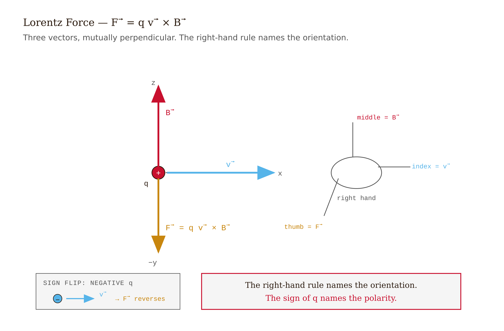
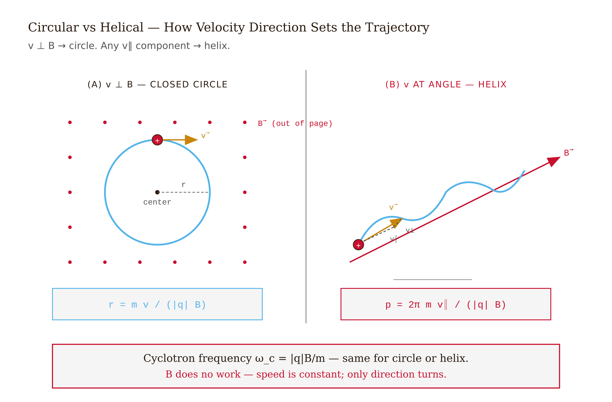
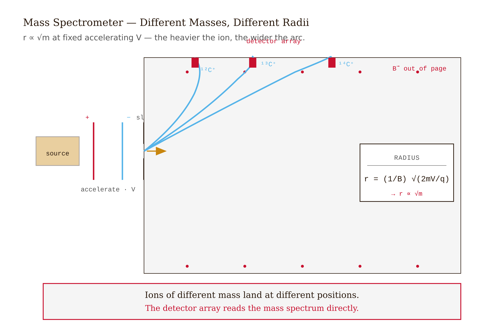
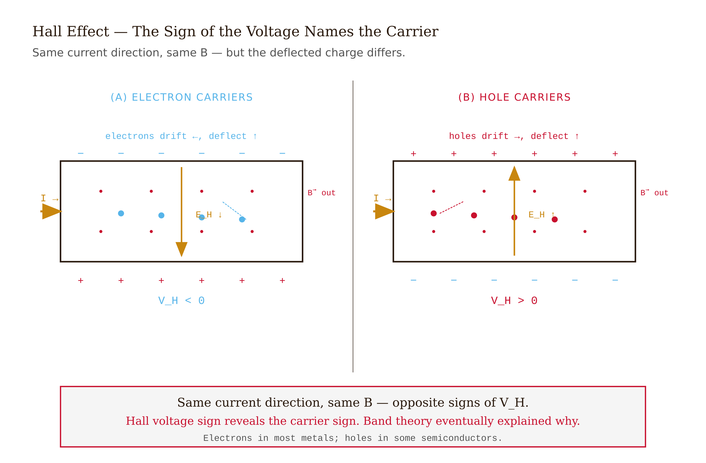
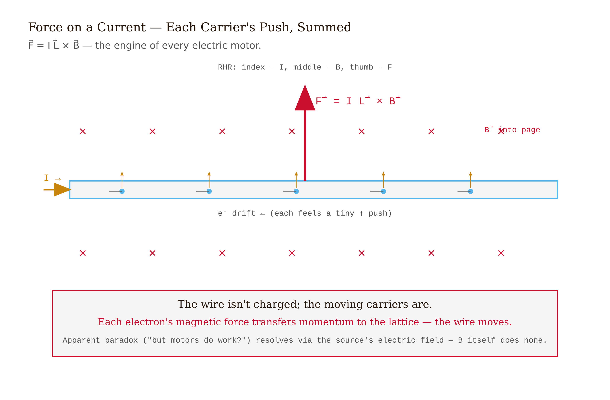
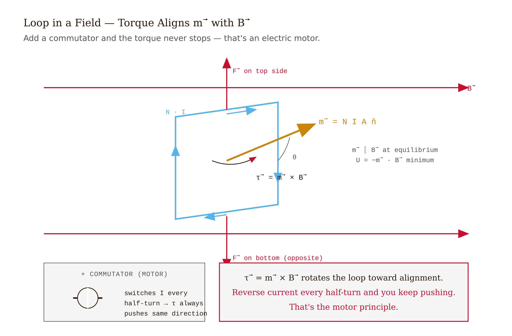

# Chapter 8 — Magnetism and the Magnetic Force

*Moving charges feel a force perpendicular to motion, and circle into geometry without classical analog.*

---

Here is a force unlike any we have seen.

In Chapter 2, the electric force pointed along the line between charges — directly at the thing causing it, proportional to distance in a clean inverse-square law. That is the kind of force Newtonian mechanics trained us to expect: push or pull, along the line of action, doing work, changing speed.

The magnetic force does none of those things. It acts perpendicular to the velocity of the charge — not toward any source, not along any obvious line. It cannot speed a charge up or slow it down; it can only change direction. And it vanishes entirely if the charge is standing still.

This is strange enough that it's worth sitting with before we write down the formula. A charged particle at rest in a magnetic field feels nothing. Move it, and a force appears — sideways, not forward, always perpendicular to the motion. Move it faster, and the force grows proportionally, still perpendicular. The particle circles. It never gains or loses speed. It traces a circle of precise radius and returns to where it started, over and over, in a fixed period that doesn't depend on how fast it's going.

That last fact — period independent of speed — is what makes the cyclotron work. It is what makes mass spectrometers possible. It is the physics behind MRI machines, particle accelerators, and the aurora borealis. Let's find out where it comes from.

---

## The force law

A charge $q$ moving with velocity $\vec{v}$ in a magnetic field $\vec{B}$ feels a force:

$$\vec{F} = q\vec{v} \times \vec{B}$$

The full **Lorentz force**, including an electric field, is:

$$\vec{F} = q(\vec{E} + \vec{v} \times \vec{B})$$

Three things to notice immediately.

**Direction.** The cross product $\vec{v} \times \vec{B}$ is perpendicular to both $\vec{v}$ and $\vec{B}$. Right-hand rule: fingers along $\vec{v}$, curl toward $\vec{B}$, thumb gives the direction of the force for positive charge. For negative charge, reverse. The force is never in the direction of motion, never toward the source of the field — it's sideways, always sideways.

**Magnitude.** $|\vec{F}| = |q|vB\sin\theta$, where $\theta$ is the angle between $\vec{v}$ and $\vec{B}$. When $\vec{v}$ and $\vec{B}$ are parallel, the force vanishes. When they are perpendicular, it is maximum. A charge moving exactly along a field line feels nothing; a charge moving perpendicular to the field feels the full force.

**A charge at rest feels nothing.** Magnetic forces require motion. This is the deepest clue that magnetism and electricity are not as separate as they first appear — in Chapter 11 we will see that a magnetic field in one reference frame can look like an electric field in another. For now, accept the law as given.

The unit of magnetic field is the **tesla** (T). For scale: Earth's surface field is 25–65 µT. A bar magnet at arm's length, ~0.01 T. A clinical MRI, 1.5–3 T. The LHC's bending dipoles, 8.3 T.

*Figure 8.1 — Lorentz Force*

<!-- → [IMAGE: diagram of the Lorentz force — a positive charge moving right with velocity v, a magnetic field B pointing into the page, and the resulting force F pointing upward, with the right-hand rule illustrated — then the same diagram for a negative charge showing force downward — to establish the direction rule concretely before any discussion] -->

---

## The magnetic force does no work

This is the magnetic force's central peculiarity, and it is worth a careful argument.

The rate at which a force does work on a particle is $P = \vec{F} \cdot \vec{v}$. For the magnetic force:

$$P_{\text{mag}} = \vec{F}_{\text{mag}} \cdot \vec{v} = q(\vec{v} \times \vec{B}) \cdot \vec{v} = 0$$

The last equality follows from the fact that a cross product is always perpendicular to each of the factors — $\vec{v} \times \vec{B}$ is perpendicular to $\vec{v}$, so their dot product is zero. This is exact, always, without approximation.

The kinetic energy of a charged particle moving in a pure magnetic field is conserved. The speed never changes. Only the direction changes.

Newtonian intuition rebels slightly here. We are used to thinking "force causes acceleration causes speed change." But acceleration means rate of change of velocity — a vector — and changing direction is acceleration just as much as changing speed. The magnetic force produces centripetal acceleration: it constantly deflects the particle but never adds to its kinetic energy.

If you watch a particle spiral in a magnetic field and it *is* gaining speed, there is an electric field somewhere. The electric force does work; the magnetic force does not.

*Figure 8.2 — Circular and Helical Motion in a Uniform Magnetic Field*

<!-- → [IMAGE: circular orbit of a positive charge in a uniform B field (into page) — the velocity vector tangent to the circle, the magnetic force vector pointing radially inward (centripetal), and the speed labeled as constant — to make the work-free deflection visual] -->

---

## Circles

Put a charge $q$ in a uniform field $\vec{B} = B\hat{z}$, with initial velocity $\vec{v}_0$ entirely in the $xy$-plane (perpendicular to $\vec{B}$). The magnetic force is always in the $xy$-plane, perpendicular to $\vec{v}$, and constant in magnitude since $|\vec{v}|$ is constant. That is precisely the condition for uniform circular motion.

Equate the magnetic force to the centripetal force needed for a circle of radius $r$:

$$|q|vB = \frac{mv^2}{r}$$

Solve for the **cyclotron radius**:

$$\boxed{\;r = \frac{mv}{|q|B}\;}$$

The period of one complete orbit — the time to go around the circle once:

$$T = \frac{2\pi r}{v} = \frac{2\pi m}{|q|B}$$

And the **cyclotron frequency**:

$$\boxed{\;\omega_c = \frac{|q|B}{m}\;}$$

Look at what is not in that last formula: $v$ is absent. The cyclotron frequency depends on the charge-to-mass ratio and the field strength, but not on how fast the particle is moving. A fast particle traces a bigger circle; a slow particle traces a smaller circle; but they both complete one revolution in the same time. This is the fundamental fact that makes the cyclotron possible — and it is not obvious from the original force law. It emerges from the combination of circular geometry and the linear dependence of force on speed.

Ernest Lawrence figured this out in 1930 and built the first cyclotron. You accelerate a particle across a gap between two D-shaped electrodes at the cyclotron frequency; each time the particle crosses the gap it gains energy and spirals outward, but the frequency needed to synchronize the kicks stays constant. You can keep adding energy indefinitely (up to the relativistic corrections that set the practical upper limit on cyclotrons).

*Figure 8.3 — Mass Spectrometer*

<!-- → [IMAGE: cyclotron schematic — two D-shaped electrodes (dees) with a particle spiraling outward from center, each half-circle labeled with increasing radius, the accelerating gap labeled with the alternating voltage — showing how the constant cyclotron frequency allows repeated kicks at every crossing] -->

---

## Helices

What if the initial velocity has a component along $\vec{B}$, not just perpendicular to it?

Decompose: $\vec{v} = \vec{v}_\parallel + \vec{v}_\perp$ where $\vec{v}_\parallel$ is along $\vec{B}$ and $\vec{v}_\perp$ is perpendicular to it. The magnetic force on $\vec{v}_\parallel$ is $q\vec{v}_\parallel \times \vec{B} = 0$ — no force. The magnetic force on $\vec{v}_\perp$ produces circular motion as before, with radius $r = mv_\perp/(|q|B)$.

The result: the particle spirals. The perpendicular component drives it around a circle; the parallel component carries it straight along the field line simultaneously. The combined motion is a **helix** — a corkscrew winding along $\vec{B}$.

*Figure 8.4 — Hall Effect*

<!-- → [IMAGE: helical trajectory of a charged particle — the circular component shown in the plane perpendicular to B, the forward motion along B, and the resulting corkscrew path with pitch labeled as p = v_parallel × T_c — to make the superposition of circular + linear motion geometric] -->

This is how charged particles from the sun get funneled into Earth's polar atmosphere. A solar-wind proton entering the magnetosphere has some velocity component along Earth's field lines and some perpendicular to them. The perpendicular component causes it to spiral; the parallel component carries it toward the poles, where the field lines converge and eventually dip into the atmosphere. The radius of the spiral is about 140 km (we'll compute this in a moment). The proton spirals down a field line into the upper atmosphere, where it collides with atmospheric molecules and produces the aurora.

---

## The mass spectrometer

The circular-orbit formula contains mass. Every other quantity — charge, speed, field — can be set or measured independently. That means you can *measure mass* by measuring radius.

Ionize a sample: each molecule acquires charge $+e$. Accelerate the ions through a potential difference $V$: the kinetic energy is $\frac{1}{2}mv^2 = eV$, so $v = \sqrt{2eV/m}$. Inject them perpendicular to a uniform field $\vec{B}$. They follow circles of radius:

$$r = \frac{mv}{eB} = \frac{1}{B}\sqrt{\frac{2mV}{e}}$$

Two isotopes of the same element have the same charge but different masses. They land at different positions on a detector strip. From the landing position, read the mass; from the count rate, read the abundance.

*Figure 8.5 — Force on a Current-Carrying Wire*

<!-- → [IMAGE: mass spectrometer schematic — ions accelerated through voltage V, entering a uniform B field region, following circular arcs of different radii for different masses, landing at separated spots on a detector strip — with radius formula labeled] -->

This is the whole machine, on one equation. Modern instruments refine the geometry — time-of-flight analyzers, quadrupole filters, orbitrap mass analyzers — but every version is ultimately doing what this formula does: using $\vec{F} = q\vec{v} \times \vec{B}$ in a controlled geometry to separate charges by $m/q$.

---

## Worked numbers: a proton in Earth's field

A solar-wind proton enters Earth's magnetosphere with $v = 4 \times 10^5$ m/s perpendicular to $\vec{B}$. At the relevant altitude, $B \approx 3 \times 10^{-5}$ T.

**Cyclotron radius:**
$$r = \frac{mv}{|q|B} = \frac{(1.67 \times 10^{-27})(4 \times 10^5)}{(1.6 \times 10^{-19})(3 \times 10^{-5})} \approx 1.4 \times 10^5 \text{ m} = 140 \text{ km}$$

**Cyclotron period:**
$$T = \frac{2\pi m}{|q|B} = \frac{2\pi (1.67 \times 10^{-27})}{(1.6 \times 10^{-19})(3 \times 10^{-5})} \approx 2.2 \text{ ms}$$

One revolution in about two milliseconds. And $r = 140$ km is small compared to Earth's diameter ($\sim 12{,}000$ km), which means protons can't cross field lines easily — they spiral along them. This is what confines the Van Allen belt particles and is what shapes the aurora into ovals around the magnetic poles rather than a random scatter.

For comparison: an ultra-high-energy cosmic-ray proton at $10^{20}$ eV has $\gamma mv/(|q|B) \sim$ a few megaparsecs in the galactic field. It barely curves on the scale of the galaxy. That's why we can't trace ultra-high-energy cosmic rays back to their sources with magnetic deflection: they travel almost straight across the universe before arriving at our detectors.

---

## Force on a current-carrying wire

Current is moving charges. If moving charges feel a magnetic force, wires carrying current feel a magnetic force.

A wire of length $L$ carrying current $I$ in direction $\hat{L}$, placed in a field $\vec{B}$:

$$\vec{F} = I\vec{L} \times \vec{B}$$

For a more general wire shape, integrate: $\vec{F} = \int I\,d\vec{\ell} \times \vec{B}$.

This is the force law for the electric motor. Wind a coil of wire, run a current through it, place it in a magnetic field from a permanent magnet — the coil experiences a force on each of its sides, and the geometry is arranged so those forces produce a torque. The coil rotates. A commutator switches the current direction at the right moment to keep the torque always in the same sense. Every electric motor on the planet — from the servo in your car's power window to the megawatt drive in an electric locomotive — is this equation at work.

*Figure 8.6 — Torque on a Current Loop*

<!-- → [IMAGE: rectangular current loop in a uniform magnetic field — forces on the two current-carrying sides shown as arrows (one up, one down, net torque) — the magnetic moment vector m shown normal to the loop, the field B shown horizontal, and the torque vector τ = m × B shown — to make the motor principle visible] -->

---

## Torque on a current loop

A rectangular loop of area $A$, carrying current $I$, in a uniform field $\vec{B}$. The forces on opposite sides are equal and opposite — no net force on the loop as a whole. But they act at different locations, producing a net torque.

Define the **magnetic dipole moment**:

$$\vec{m} = NIA\hat{n}$$

where $N$ is the number of turns, $A$ is the enclosed area, and $\hat{n}$ is the normal to the loop (direction by right-hand rule from the current circulation). The torque is:

$$\vec{\tau} = \vec{m} \times \vec{B}$$

The loop rotates to align $\vec{m}$ with $\vec{B}$. The potential energy is $U = -\vec{m} \cdot \vec{B}$, minimum when $\vec{m}$ and $\vec{B}$ point the same way.

This is the analog of the electric dipole in Chapter 2. An electric dipole $\vec{p}$ in field $\vec{E}$ experiences torque $\vec{p} \times \vec{E}$ and potential energy $-\vec{p} \cdot \vec{E}$. The magnetic case is identical with $\vec{p} \to \vec{m}$ and $\vec{E} \to \vec{B}$. The parallel runs deep — both are dipole moments interacting with their respective fields.

The same torque formula works for atomic-scale magnetic moments: a spinning electron or a nucleus with magnetic moment $\vec{m}$ in an external field $\vec{B}$ precesses under this torque. That precession — the Larmor precession — is the phenomenon MRI machines detect. Apply a strong static $\vec{B}$; the atomic moments precess at the Larmor frequency $\omega = |q|B/m$ (same cyclotron formula); hit them with a radiofrequency pulse at that frequency; they absorb and then reemit energy at a frequency that depends on the local chemical environment. From those frequencies, image the tissue.

---

## The Hall effect

Here is a subtler consequence of the magnetic force on moving charges — one that actually tells you something the force law alone cannot: the *sign* of the charge carriers.

A thin conducting strip carries current $I$ in the $+\hat{x}$ direction, and a magnetic field $\vec{B} = B\hat{z}$ is applied perpendicular to the strip. Whatever the charge carriers are, they are moving in the $+\hat{x}$ direction (if positive) or $-\hat{x}$ direction (if negative — electrons drifting opposite to conventional current).

The magnetic force on positive carriers moving in $+\hat{x}$: $q\vec{v} \times \vec{B} = q v \hat{x} \times B\hat{z} = -qvB\hat{y}$ — toward the $-y$ edge.

The magnetic force on negative carriers moving in $-\hat{x}$: $(-e)(-v)\hat{x} \times B\hat{z} = evB(-\hat{y})$ — also toward the $-y$ edge.

Wait. Both positive carriers going right and negative carriers going left accumulate on the same edge? No — I made a sign error. Let me redo it carefully.

Positive carriers moving in $+\hat{x}$: force is $qvB(\hat{x} \times \hat{z}) = qvB(-\hat{y})$ — toward $-y$.
Negative carriers (electrons) moving in $-\hat{x}$: force is $(-e)(-v)B(\hat{x} \times \hat{z}) = (-e)(-v)B(-\hat{y}) = -evB\hat{y}$ — toward $-y$ again.

So both push carriers toward the same edge, building up the same sign of surface charge there — *except* the surface charges have opposite signs because the carriers are opposite. In one case, positive charge accumulates on the $-y$ edge. In the other, negative charge accumulates there. The transverse voltage has opposite sign.

This is the Hall effect. Edwin Hall discovered it in 1879. The transverse **Hall voltage** across the strip's width $w$ in steady state:

$$V_H = \frac{IB}{nqt}$$

where $t$ is the strip thickness and $q$ carries a sign. In most metals, $q = -e$ and $V_H$ is negative. In some semiconductors and a few exotic metals (copper iodide, certain hole-conducting materials), $V_H$ is positive — meaning the current is carried by positive quasi-particles called **holes**: vacancies in a nearly-full electron band that behave as positive charges. The Hall effect was, for years, the only way to determine the sign of carriers in a material, and it showed that classical Drude theory was incomplete.

The **quantum Hall effect** (von Klitzing, 1980; Nobel 1985) is a different phenomenon: in two-dimensional electron systems at strong fields and low temperatures, the Hall resistance is quantized in exact integer or fractional multiples of $h/e^2 = 25{,}812.807\ldots$ Ω. The integer QHE is now used to define the standard resistance ohm. The fractional QHE reveals strongly correlated quantum states of matter that are active research in 2026.

<!-- → [IMAGE: Hall effect setup diagram — current-carrying strip with B perpendicular (into page), electron drift direction labeled, force deflecting electrons to one edge, accumulated negative charge on that edge, and the resulting Hall voltage V_H shown across the width — then a second panel showing the same setup with holes as carriers, force deflecting them to the same edge but producing positive surface charge and opposite-sign V_H] -->

---

## What the Lorentz force is not telling you

There is something missing from this whole chapter that I should name.

We have asked what a magnetic field *does* to charges. We have not asked where magnetic fields *come from*. That is Chapter 9: the Biot-Savart law, Ampère's law, the magnetic field produced by a straight wire and a solenoid and a magnetic dipole. The structure of that chapter mirrors Chapter 2 and 3 — there, charges are the sources of $\vec{E}$; here, *currents* are the sources of $\vec{B}$.

There is also a deeper question: why does the magnetic force have the form $q\vec{v} \times \vec{B}$ at all? The answer, fully worked out, is special relativity. A charge moving through a magnetic field in one reference frame is, in a suitably boosted frame, a charge in a transformed electric field. Magnetism is what electric forces look like to a moving observer. Coulomb's law plus special relativity *implies* the magnetic force law. We will see the beginning of this in Chapter 11, when Maxwell's equations are shown to be Lorentz-covariant — built so that they look the same in all inertial frames.

For now: the Lorentz force is exact in classical electrodynamics. It has been confirmed in cyclotrons, mass spectrometers, particle accelerators, Hall sensors, and electric motors. Every result in this chapter — circular orbits, mass separation, motor torques, Hall voltages — is a consequence of $\vec{F} = q\vec{v} \times \vec{B}$ applied to clean geometries.

<!-- → [INFOGRAPHIC: map of chapter applications — central node "F = qv × B" with five branches: (1) circular orbit → cyclotron radius/frequency → cyclotron and MRI; (2) helical orbit → spiral along field lines → Van Allen belts and aurora; (3) mass separation → r ∝ √m → mass spectrometer; (4) force on wire → I L × B → electric motor; (5) carrier deflection → Hall voltage sign → sign of charge carriers — shows that one force law spans the whole chapter] -->

---

## One thing still genuinely puzzling

If magnetic forces do no work, how do electric motors do work?

The resolution is careful but correct. In a motor, current-carrying wires move through a magnetic field. The magnetic force on the current-carrying electrons is perpendicular to their total velocity — but their total velocity has two components: the drift velocity along the wire, and the macroscopic velocity of the wire itself as it moves. The magnetic force on the drift component does no work. But the magnetic force on the macroscopic velocity component has a component along the drift direction — which is exactly what opposes the current and is the "back-EMF" of the motor. The actual work comes from the electrical source driving the current against this back-EMF; the magnetic force mediates the transfer but does not supply the energy.

More concisely: it's the electric field inside the wire — maintained by the source — that does work on the electrons. The magnetic force organizes the geometry; the electric source provides the energy. This is a subtle point that Feynman discusses explicitly in the Lectures, and it is one of the places where the macroscopic description ("force on the wire does work") and the microscopic description ("magnetic force on individual electrons does no work") need to be reconciled carefully.

---

## Exercises

**Warm-up.** A proton enters a uniform magnetic field of $B = 0.5$ T with speed $v = 10^6$ m/s perpendicular to $\vec{B}$. Compute (a) the cyclotron radius, (b) the cyclotron period, (c) the cyclotron frequency. Use $m_p = 1.67 \times 10^{-27}$ kg and $e = 1.6 \times 10^{-19}$ C. Then repeat for an alpha particle ($m = 4m_p$, $q = +2e$) at the same speed. Which has the larger radius? Which has the larger period? *Tests: cyclotron radius and frequency formulas, $q/m$ ratio dependence.*

**Warm-up.** A charge $q = -3$ µC moves with velocity $\vec{v} = 4 \times 10^5\,\hat{x}$ m/s through a magnetic field $\vec{B} = 0.2\,\hat{z}$ T. (a) Compute $\vec{F} = q\vec{v} \times \vec{B}$, including sign and direction. (b) A second identical charge moves with $\vec{v} = 4 \times 10^5\,\hat{z}$ m/s (parallel to $\vec{B}$). What is the force on it? (c) Explain in one sentence why a stationary charge in a magnetic field feels no force. *Tests: cross-product mechanics, parallel-field case, conceptual foundation.*

**Warm-up.** Show algebraically that the magnetic force does no work: starting from $P = \vec{F} \cdot \vec{v}$ and $\vec{F} = q\vec{v} \times \vec{B}$, prove $P = 0$. State which vector identity you use and why it applies here. *Tests: work calculation, cross-product perpendicularity, clean one-step proof.*

**Application.** Mass spectrometer: singly-ionized $^{12}$C and $^{13}$C ions (masses $m_{12} = 1.993 \times 10^{-26}$ kg, $m_{13} = 2.159 \times 10^{-26}$ kg) are each accelerated through $V = 1{,}000$ V and injected into a uniform field $B = 0.2$ T perpendicular to their motion. (a) Find the speed of each ion after acceleration. (b) Find the cyclotron radius of each. (c) If both ions enter at the same point, by how many millimeters are their landing positions separated on a detector 2 radii away? *Tests: KE from acceleration, radius formula, precision mass measurement.*

**Application.** A horizontal copper wire of length $L = 0.8$ m carries current $I = 12$ A in the $+\hat{x}$ direction. A uniform field $\vec{B} = 0.3\,\hat{z}$ T fills the region. (a) Find the magnetic force on the wire. (b) If the wire has linear mass density $\lambda = 0.05$ kg/m, at what current would the magnetic force exactly balance gravity (take $g = 9.8$ m/s²)? (c) Explain why this principle — magnetic levitation of a current-carrying wire — requires an external current source to maintain, and why it isn't free energy. *Tests: $\vec{F} = I\vec{L} \times \vec{B}$, force balance, energy bookkeeping.*

**Application (Hall).** A copper strip carries $I = 10$ A in $+\hat{x}$. The strip is $t = 1$ mm thick and $w = 1$ cm wide. A field $\vec{B} = 0.5\,\hat{z}$ T is applied. Using copper carrier density $n = 8.5 \times 10^{28}$ m$^{-3}$: (a) compute the Hall voltage $V_H = IB/(nqt)$; (b) identify which edge ($+y$ or $-y$) accumulates negative charge, and explain using the force on the drifting electrons; (c) if the same measurement gave a *positive* Hall voltage, what would that imply about the charge carriers? *Tests: Hall voltage formula, sign reasoning, physical interpretation of anomalous Hall coefficient.*

**Synthesis.** A rectangular current loop of sides $a = 4$ cm and $b = 6$ cm carries $I = 2$ A and has $N = 50$ turns. It sits in a uniform field $B = 0.3$ T with its normal initially perpendicular to $\vec{B}$ (maximum torque configuration). (a) Compute the magnetic dipole moment $|\vec{m}|$. (b) Compute the torque $|\vec{\tau}| = mB\sin\theta$ at $\theta = 90°$. (c) Compute the potential energy $U = -\vec{m} \cdot \vec{B}$ at $\theta = 90°$ and at $\theta = 0°$ (aligned). (d) How much work does the field do as the loop rotates from $\theta = 90°$ to $\theta = 0°$? *Tests: magnetic moment formula, torque, potential energy, work from energy difference.*

**Synthesis.** Two particles with the same kinetic energy $K$ but different masses $m_1$ and $m_2$ enter a uniform magnetic field perpendicular to their motion. (a) Express the speed of each in terms of $K$ and $m$. (b) Show that the ratio of cyclotron radii is $r_1/r_2 = \sqrt{m_1/m_2}$. (c) Explain physically why the heavier particle has the *larger* radius, despite moving more slowly. (The answer involves both $r = mv/(qB)$ and the relationship between $K$, $m$, and $v$.) *Tests: energy-to-velocity conversion, ratio derivation, physical reasoning about the competing effects.*

**Challenge.** A particle of charge $q$ and mass $m$ moves in crossed fields: $\vec{E} = E\hat{y}$ and $\vec{B} = B\hat{z}$, with initial velocity $\vec{v}_0 = 0$. (a) Starting from Newton's second law $m\dot{\vec{v}} = q(\vec{E} + \vec{v} \times \vec{B})$, write the coupled differential equations for $v_x(t)$ and $v_y(t)$. (b) Show that the solution describes **cycloidal motion**: the particle circles while drifting in the $+\hat{x}$ direction at the $E \times B$ drift velocity $v_d = E/B$. (c) Verify that the drift velocity $E/B$ is independent of $q$ and $m$ — all particles drift at the same speed regardless of their charge-to-mass ratio. (d) Explain physically why this mass-independence is not a coincidence. *Tests: coupled ODEs from Lorentz force, cycloidal solution, E×B drift, physical insight into universality of the drift.*

<!-- → [CHART: cyclotron radius r vs. kinetic energy K for three particles (electron, proton, alpha) in B = 1 T — log-log plot showing r ∝ √(mK) with three parallel lines offset by √(m/q²) — student should see how same-energy particles of different masses separate in radius, directly connecting to mass spectrometer operation] -->

---

## LLM Exercises

### Build the charged-particle trajectory simulator (`08-particle-trajectory.html`)

> **Show.** Lorentz force: $\vec{F} = q(\vec{E} + \vec{v} \times \vec{B})$. In a uniform $\vec{B}$ alone, a charge moves in a circle (if $\vec{v} \perp \vec{B}$) or helix (otherwise).
>
> **Say.** Build a 3D trajectory simulator for a charged particle in configurable $\vec{E}$ and $\vec{B}$ fields.
>
> **Constrain.** D3 v7 for visualization (project 3D to 2D). Sliders: charge $q$ (positive/negative), mass $m$, initial velocity vector $(v_x, v_y, v_z)$, magnetic field $(B_x, B_y, B_z)$, electric field $(E_x, E_y, E_z)$. Integrate Newton's second law $m\,d\vec{v}/dt = q(\vec{E} + \vec{v} \times \vec{B})$ using RK4 with timestep $\Delta t = T_c/100$ where $T_c$ is the cyclotron period. Draw the trail of recent positions. Display cyclotron radius and frequency as readouts. Filename: `08-particle-trajectory.html`.
>
> **Verify.** (a) $\vec{v} \perp \vec{B}$, no $\vec{E}$: circular motion at the predicted radius. (b) $\vec{v}$ at angle to $\vec{B}$: helix. (c) Add $\vec{E}$ perpendicular to both $\vec{B}$ and $\vec{v}$: a drift (E×B drift) appears.

### Exploration

- Vary the magnetic field strength. Verify $r \propto 1/B$ and $\omega \propto B$.
- Set up the mass-spectrometer geometry: $V_{\text{accel}}$ → $v = \sqrt{2qV/m}$ → uniform $\vec{B}$ → radius. Try two ions of different masses but same charge. Match your hand calculation.
- Set up a crossed-field drift: $\vec{E}$ and $\vec{B}$ perpendicular. The particle drifts at velocity $\vec{v}_{\text{drift}} = \vec{E} \times \vec{B}/B^2$ on top of its circular motion. Verify.

### Extension prompt (chapter bridge)

> **Show.** Now I know what a magnetic field does to a moving charge. But: where do magnetic fields come from?
>
> **Say.** Build a magnetic field-line visualizer for various current configurations: straight wire, circular loop, solenoid cross-section.
>
> **Constrain.** Apply the Biot-Savart law to compute $\vec{B}$ at every grid point. Draw field lines by RK4 integration. Color the current with orange arrows; field lines in purple. Filename: `08b-field-from-currents-preview.html`.
>
> **Verify.** Straight wire: circular field lines around the wire. Two parallel wires, same direction: lines bunch between them. Opposite direction: lines spread out between them.

This is the lead-in to Chapter 9.

---

**Tags:** Lorentz force, magnetic field, tesla, cyclotron, mass spectrometer, Hall effect, magnetic dipole moment, torque
